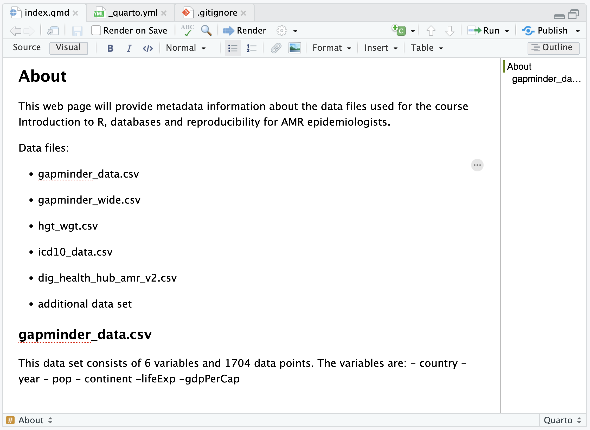
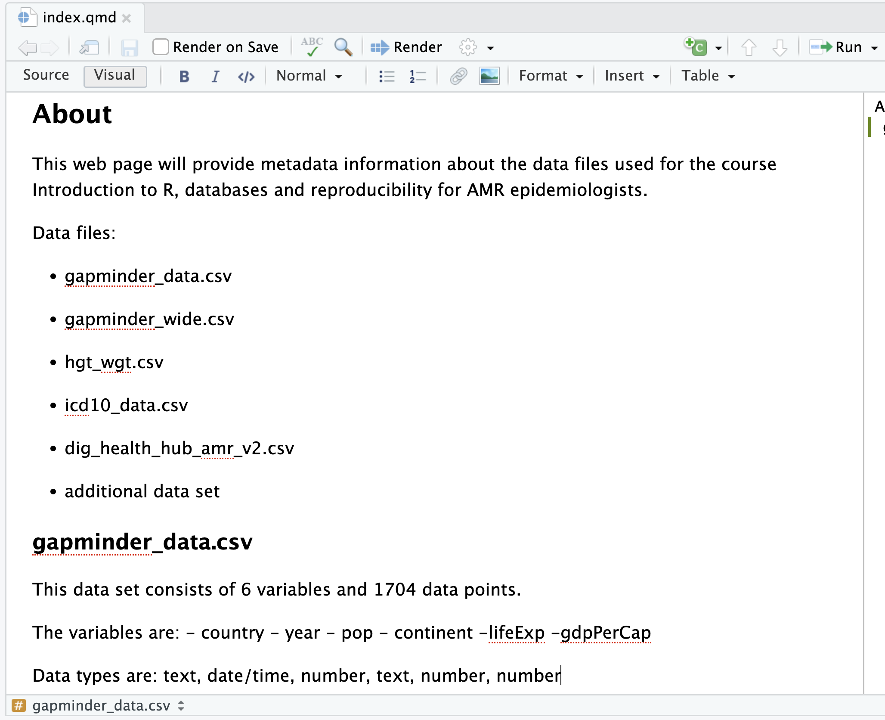
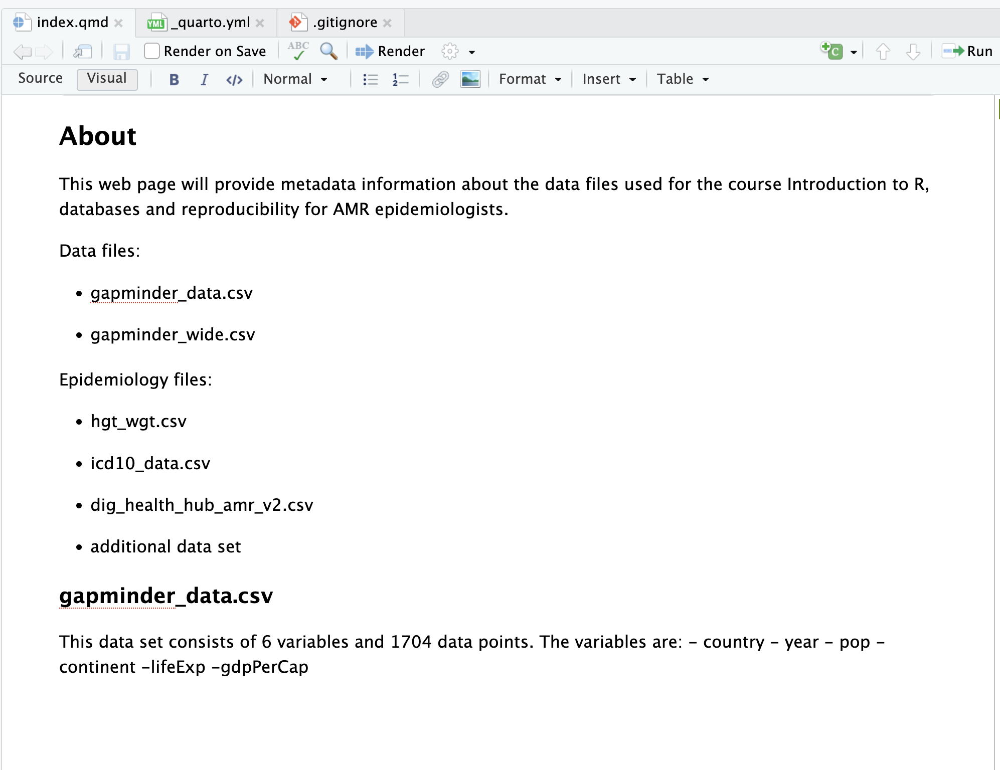
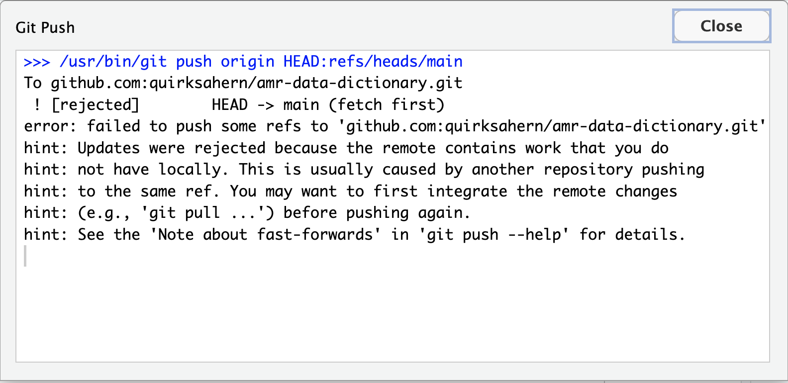
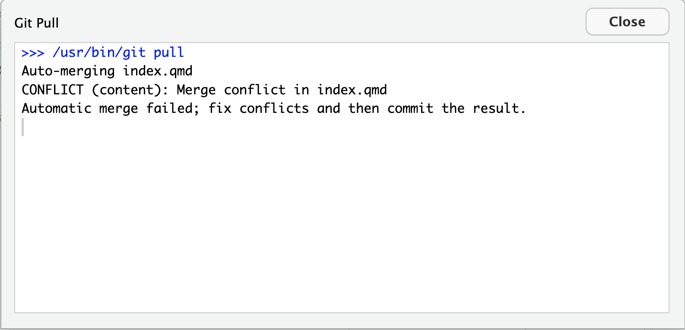
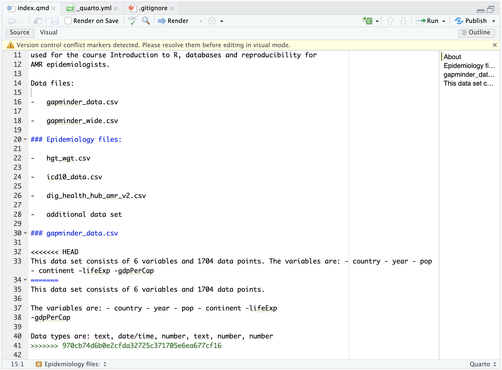
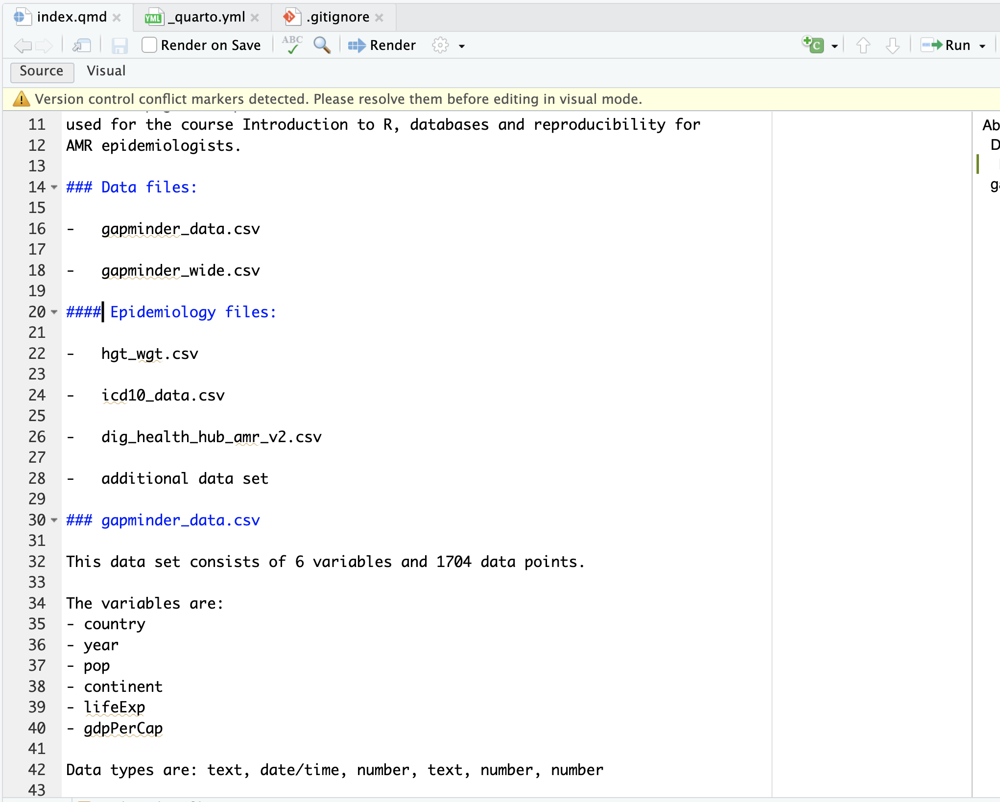
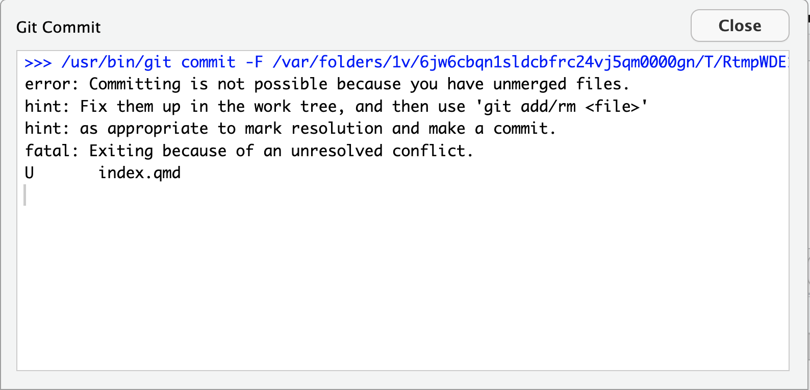
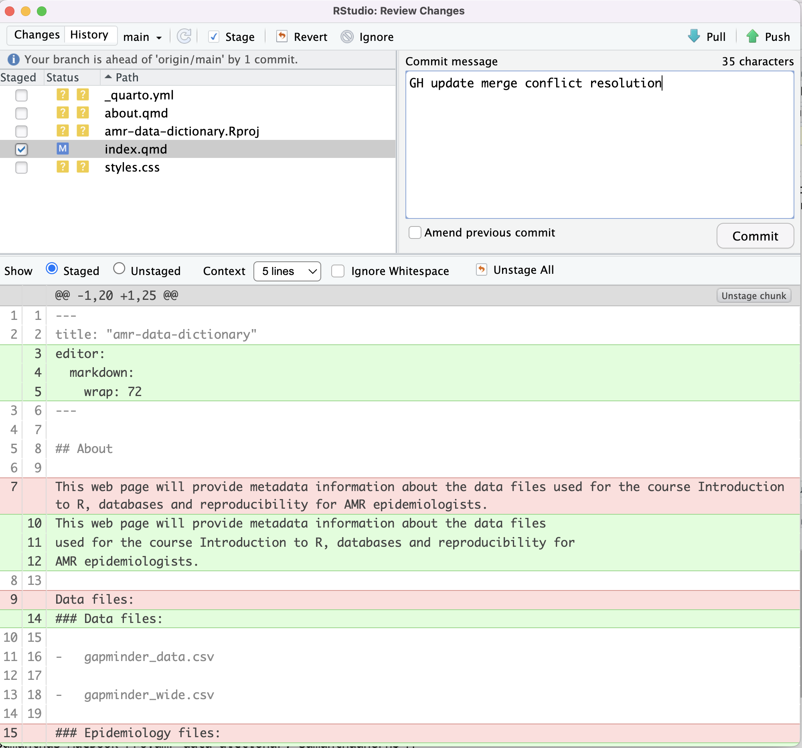
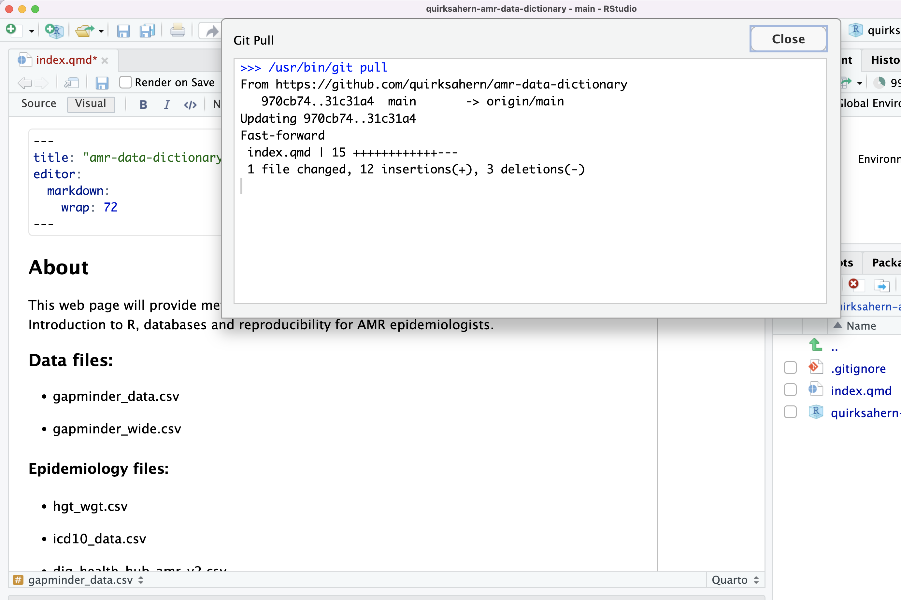

::::::::::::::::::::::::::::::::::::::: objectives

- Explain what conflicts are and when they can occur.
- Resolve conflicts resulting from a merge.

::::::::::::::::::::::::::::::::::::::::::::::::::

:::::::::::::::::::::::::::::::::::::::: questions

- What do I do when my changes conflict with someone else's?

::::::::::::::::::::::::::::::::::::::::::::::::::

As soon as people can work in parallel, they'll likely step on each other's
toes.  This will even happen with a single person: if we are working on
a piece of software on both our laptop and a server in the lab, we could make
different changes to each copy.  Version control helps us manage these
[conflicts](../learners/reference.md#conflict) by giving us tools to
[resolve](../learners/reference.md#resolve) overlapping changes.

To see how we can resolve conflicts, we must first create one.  The file
`index.qmd` currently looks like this in both partners' copies of our `amr-data-dictionary`
repository:

{alt='A screenshot showing current mirrored state of index.qmd'}

Let's add a line to the collaborator's copy only:

{alt='A screenshot showing collaborator update to index.qmd'}

commit changes and then push the change to GitHub.

Now let's have the owner
make a different change to their copy
*without* updating from GitHub:

{alt='A screenshot showing owner update to index.qmd on a different line'}

We can commit the change locally:

```
>>> /usr/bin/git commit -F /var/folders/1v/6jw6cbqn1sldcbfrc24vj5qm0000gn/T/RtmpWDE1pb/git-commit-message-165ad3fe9bc95.txt
[main babb307] Added new sub-heading for data files
 1 file changed, 3 insertions(+), 8 deletions(-)
```

but Git won't let us push it to GitHub:

{alt='A screenshot showing conflict when attempting to Push'}

Ok, so what is happening?

{alt='A diagram showing a conflict that might occur when two sets of independent changes are merged'}

Git rejects the push because it detects that the remote repository has new updates that have not been
incorporated into the local branch.
What we have to do is pull the changes from GitHub,
[merge](../learners/reference.md#merge) them into the copy we're currently working in, and then push that.

Let's start by pulling

:::::::::::::::::::::::::::::::::::::::::  callout

## You may need to tell Git what to do

If you see the below in your output, Git is asking what it should do.

```output
hint: You have divergent branches and need to specify how to reconcile them.
hint: You can do so by running one of the following commands sometime before
hint: your next pull:
hint:
hint:   git config pull.rebase false  # merge (the default strategy)
hint:   git config pull.rebase true   # rebase
hint:   git config pull.ff only       # fast-forward only
hint:
hint: You can replace "git config" with "git config --global" to set a default
hint: preference for all repositories. You can also pass --rebase, --no-rebase,
hint: or --ff-only on the command line to override the configured default per
hint: invocation.
```

In newer versions of Git it gives you the option of specifying different
behaviours when a pull would merge divergent branches. In our case we want
'the default strategy'. To use this strategy run the following command in the `Terminal` to
select it as the default thing git should do.

```bash
$ git config pull.rebase false
```

Then attempt the pull again.


::::::::::::::::::::::::::::::::::::::::::::::::::

The `git pull` command updates the local repository to include those
changes already included in the remote repository.

{alt='A screenshot of dialogue box explaining merge conflicts need to be resolved'}

After the changes from remote branch have been fetched, Git detects that changes made to the local copy
overlap with those made to the remote repository, and therefore refuses to merge the two versions to
stop us from trampling on our previous work. The conflict is marked in
in the affected file:

{alt='A screenshot of dialogue box explaining merge conflicts need to be resolved'}

Our change is preceded by `<<<<<<< HEAD`.
Git has then inserted `=======` as a separator between the conflicting changes
and marked the end of the content downloaded from GitHub with `>>>>>>>`.
(The string of letters and digits after that marker
identifies the commit we've just downloaded.)

It is now up to us to edit this file to remove these markers
and reconcile the changes.
We can do anything we want: keep the change made in the local repository, keep
the change made in the remote repository, write something new to replace both,
or get rid of the change entirely.

Let's edit our file so that the file looks like this:

{alt='A screenshot showing modified index.qmd to resolve merge conflicts'}

We would assume that we can now commit our change:

{alt="A screenshot of dialogue box explaining that the merge hasn't been resolved and unable to commit"}

In the `Terminal let's now enter the following commands:

```bash
$ git add index.qmd
$ git status
```

```output
On branch main
Your branch and 'origin/main' have diverged,
and have 1 and 1 different commits each, respectively.
  (use "git pull" to merge the remote branch into yours)

All conflicts fixed but you are still merging.
  (use "git commit" to conclude merge)

Changes to be committed:
        modified:   index.qmd

Untracked files:
  (use "git add <file>..." to include in what will be committed)
        _quarto.yml
        about.qmd
        amr-data-dictionary.Rproj
        styles.css
```
We can now commit our change locally:

{alt='Screenshot showing commit of resolved merge'}

Now we can push our changes to GitHub.

Git keeps track of what we've merged with what,
so we don't have to fix things by hand again
when the collaborator who made the first change pulls again, we get the merged file:

{alt='Screenshot showing updated collaborator file from owner merge edits and push'}

We don't need to merge again because Git knows someone has already done that.

Git's ability to resolve conflicts is very useful, but conflict resolution
costs time and effort, and can introduce errors if conflicts are not resolved
correctly. If you find yourself resolving a lot of conflicts in a project,
consider these technical approaches to reducing them:

- Pull from upstream more frequently, especially before starting new work
- Use topic branches to segregate work, merging to main when complete
- Make smaller more atomic commits
- Push your work when it is done and encourage your team to do the same to reduce work in progress and, by extension, the chance of having conflicts
- Where logically appropriate, break large files into smaller ones so that it is
  less likely that two authors will alter the same file simultaneously

Conflicts can also be minimized with project management strategies:

- Clarify who is responsible for what areas with your collaborators
- Discuss what order tasks should be carried out in with your collaborators so
  that tasks expected to change the same lines won't be worked on simultaneously
- If the conflicts are stylistic churn (e.g. tabs vs. spaces), establish a
  project convention that is governing and use code style tools (e.g.
  `htmltidy`, `perltidy`, `rubocop`, etc.) to enforce, if necessary

:::::::::::::::::::::::::::::::::::::::  challenge

## Solving Conflicts that You Create

Clone the repository created by your instructor.
Add a new file to it,
and modify an existing file (your instructor will tell you which one).
When asked by your instructor,
pull her changes from the repository to create a conflict,
then resolve it.


::::::::::::::::::::::::::::::::::::::::::::::::::

:::::::::::::::::::::::::::::::::::::::  challenge

## A Typical Work Session

You sit down at your computer to work on a shared project that is tracked in a
remote Git repository. During your work session, you take the following
actions, but not in this order:

- *Make changes* by appending the number `100` to a text file `numbers.txt`
- *Update remote* repository to match the local repository
- *Celebrate* your success with some fancy beverage(s)
- *Update local* repository to match the remote repository
- *Stage changes* to be committed
- *Commit changes* to the local repository

In what order should you perform these actions to minimize the chances of
conflicts? Put the commands above in order in the *action* column of the table
below. A final step is populated to get you
started.

| order | action . . . . . . . . . . |  
| ----- | -------------------------- | 
| 1     |                            | 
| 2     |                            |  
| 3     |                            | 
| 4     |                            |
| 5     |                            |
| 6     | Celebrate!                 | 

:::::::::::::::  solution

## Solution

| order | action . . . . . .         | 
| ----- | -------------------------- |
| 1     | Update local               | 
| 2     | Make changes               |
| 3     | Stage changes              |
| 4     | Commit changes             |
| 5     | Update remote              |
| 6     | Celebrate!                 | 

:::::::::::::::::::::::::

::::::::::::::::::::::::::::::::::::::::::::::::::

:::::::::::::::::::::::::::::::::::::::: keypoints

- Conflicts occur when two or more people change the same lines of the same file.
- The version control system does not allow people to overwrite each other's changes blindly, but highlights conflicts so that they can be resolved.

::::::::::::::::::::::::::::::::::::::::::::::::::
