::::::::::::::::::::::::::::::::::::::: objectives

- Explain why you might want to use a branch.
- Create a branch.
- Merge a branch.

::::::::::::::::::::::::::::::::::::::::::::::::::

:::::::::::::::::::::::::::::::::::::::: questions

- What do I do when I want to try something a little different?

::::::::::::::::::::::::::::::::::::::::::::::::::

There are times when we might need to make changes to resolve a problem or to experiment with a new method. But, we do not want to do this in our main code base as we may introduce unexpected problems.

To do this safely, we can create branches. When we create a branch we are effectively creating a sandbox where we can experiment and make changes without impacting our main files.

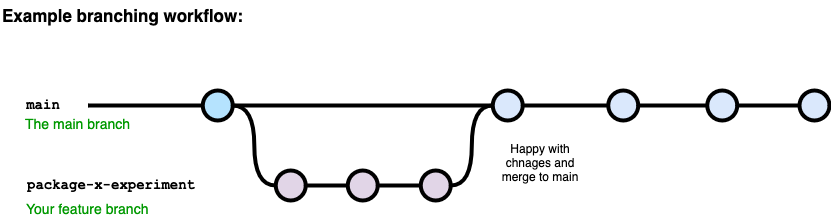{alt='diagram showing branch from main then re-merging'}

When we talk about branches, we are referring to independent lines of code that branch off the master branch, allowing developers to work independently before merging their changes back to the code base if desired.

## Creating a branch

We want to restructure our amr-data-dictionary. To explore different options we create a new branch.

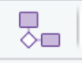{alt='diagram showing branch from main then re-merging'}

On the Git tab in the upper right panel, there is a `branches` icon.

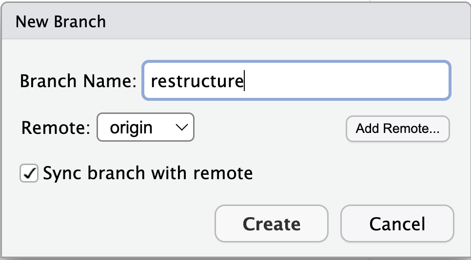{alt='creating a new Git branch called restructure'}

By clicking on this icon we are able to create a new branch, we will call this branch `restructure`.

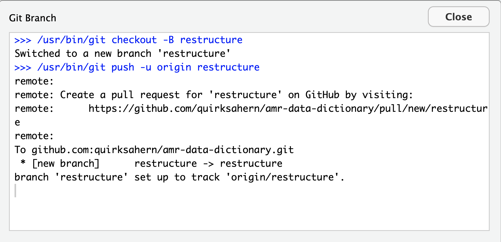{alt='creating a new Git branch called restructure'}

This will create our branch, both locally and on GitHub. We will now be working in the `restructure` branch locally.

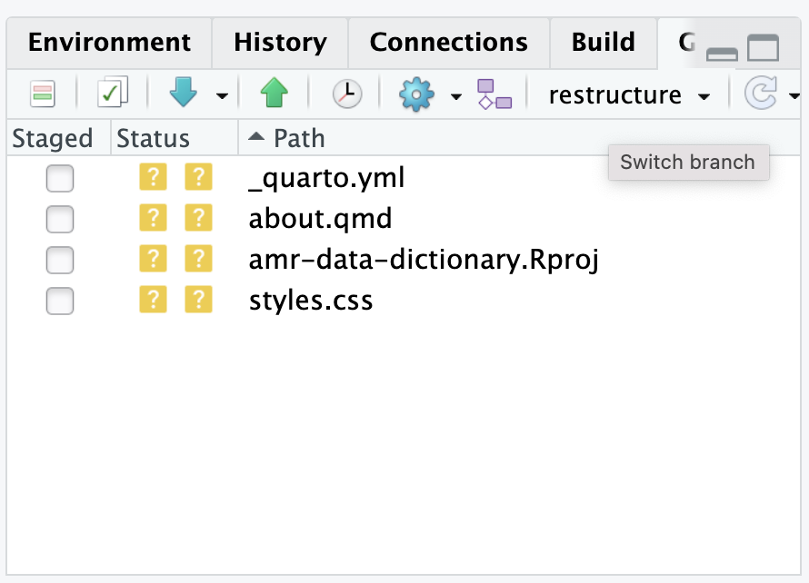{alt='screenshot in RStudio showing current working branch'}

We can work on this new branch in the same way that we previously worked on our `main` branch.

:::::::::::::::::::::::::::::::::::::::::  callout

## What is our active branch?

We now have two branches in our repository `main` and `restructure`.
Within RStudio our current active branch, where we are currently working and 
recording changes is the `restructure` branch.

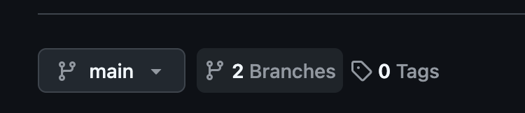{alt='GitHub branch icon, indicating number of current branches'}

When we look at our remote repository, will usually initally be shown the content
and activity of our `main` branch. However, if we click on the branches icon, it will show us information about the branch or brnaches that we have and what is the active branch. When we `pull` or `push` from within RStudio it will be from or two the active branch.

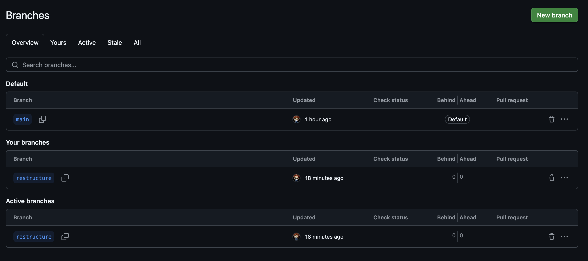{alt='GitHub screenshot showing which branches exist and the current active branch'}

::::::::::::::::::::::::::::::::::::::::::::::::::

:::::::::::::::::::::::::::::::::::::::  challenge

## Working in a branch

Make changes a local change to your index.qmd file.

Commit your change and push to GitHub.

Make some changes to your index.qmd file on GitHub, checking that you are
working in the 'restructure' branch.

Commit your change and pull to RStudio.

::::::::::::::::::::::::::::::::::::::::::::::::::

When we have finished working in a branch other than `main`, we generally have two choices.

We either have changes we want to add into `main`, or we want to delete the branch.
When we delete a branch, we are also effectively deleting all the edits that we have made to the files within that branch.

## Pull Requests

We have made to changes to our amr-data-dictionary that we would now like to be the `main` version. The mechanism that Git and GitHub provide to bring changes from other branches into `main` are `Pull Request`s.

`Pull Requests` enable collaborators to review and discuss the proposed set of changes before they are added into the main codebase.

We will create our Pull Request in GitHub, but before we do so, let's make sure that we have pushed all our committed changes to our remote repository.

### Creating a Pull Request

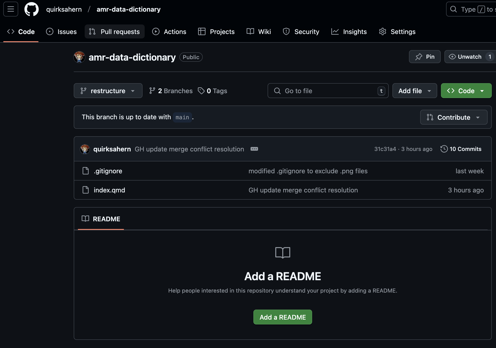{alt='GitHub screenshot showing active branch'}

We can see that there are updates to the file `index.qmd` and we want this to be added to the version in `main`. To do this we need to create a `Pull Request`, we start by clicking on `Pull request` in the GitHub toolbar.

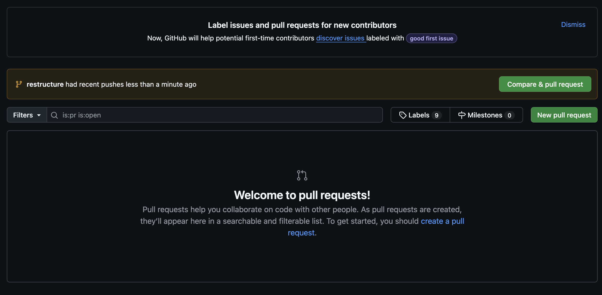{alt='GitHub screenshot showing pull requests, none currently open'}

GitHub has identified that there are differences between the files on the `restructure` branch and files on the `main` branch. We want to `Compare and pull request`

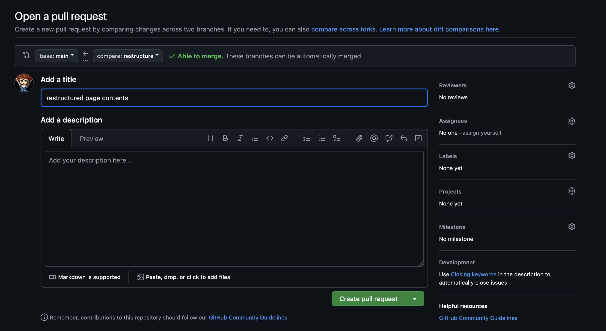{alt='GitHub screenshot showing comparison options for new pull request'}

If we look we can see that `restructure` is being compared to `main`. GitHub hasn't identified any potential conflicts and is saying that changes can be automatically `merged`. It has also helpfully added a title to our pull request.

What do you notice about this title? Is it helpful?

There is also a box to add a description of the changes and their potential impact.
Once a suitable title and description have been added, click on `Create pull request`.

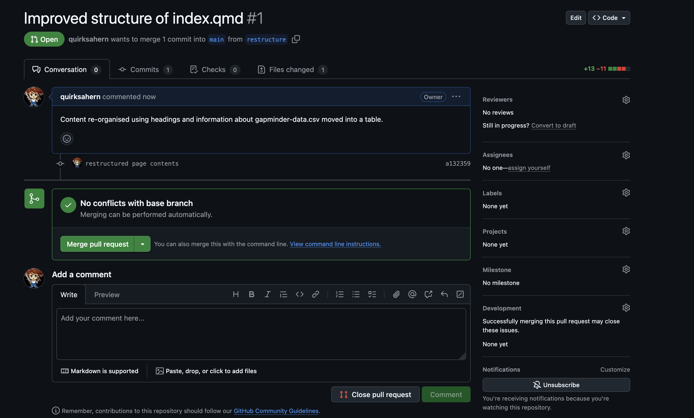{alt='GitHub screenshot showing comparison options for new pull request'}

As no conflicts have been identified we can opt to `Merge pull request`.

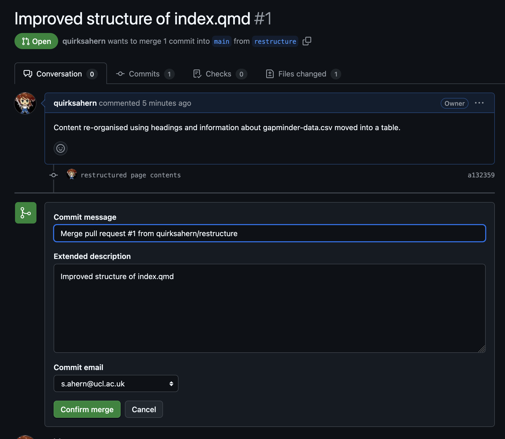{alt='GitHub screenshot confirm merge dialogue box'}

We have the option to add to or edit information about the pull request before we `Confirm merge`.

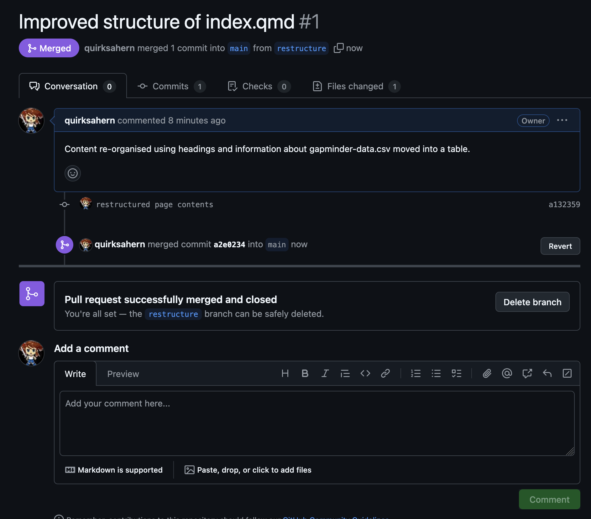{alt='GitHub screenshot showing PR merged and closed'}

Once we have confirmed, the pull request is closed and changes merged into `main`.
We could now choose to delete the branch.

In a more complex change, you may request to have a collaborator review the change before the request is approved.

Much more detailed information about branches and pull requests is available via the GitHub documentation: [Proposing changes to your work with pull requests](https://docs.github.com/en/pull-requests/collaborating-with-pull-requests/proposing-changes-to-your-work-with-pull-requests)

:::::::::::::::::::::::::::::::::::::::: keypoints

- Branches provide a safe way to experiment with new ideas or explore solutions to bugs and other issues within your files.
- Pull Requests provide the mechanism for bringing changes from other branches make into main with varying levels of oversight.

::::::::::::::::::::::::::::::::::::::::::::::::::
