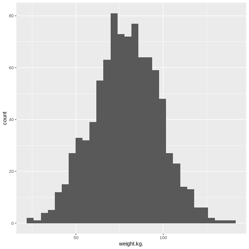
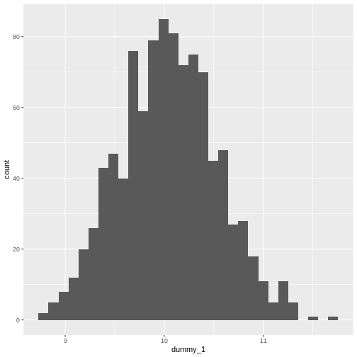
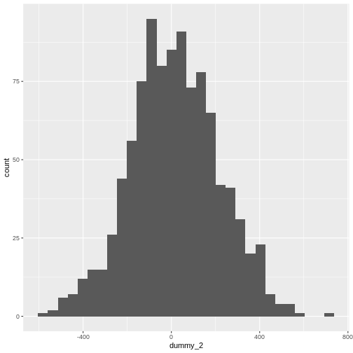

::::::::::::::::::::::::::::::::::::::: objectives

- To be able to describe the different types of data
- To be able to do basic data exploration of a dataset
- To be able to calculate descriptive statistics
- To be able to perform statistical inference on a dataset

::::::::::::::::::::::::::::::::::::::::::::::::::

:::::::::::::::::::::::::::::::::::::::: questions

- How can I detect the type of data I have?
- How can I make meaningful summaries of my data?

::::::::::::::::::::::::::::::::::::::::::::::::::

## Content

-   Types of Data
-   Exploring your dataset
-   Descriptive Statistics
-   Inferential Statistics

## Data


``` r
# We will need these libraries and this data later.
library(tidyverse)
library(ggplot2)

# loading data
hgtwgt_survey <- read.csv("data/hgt_wgt.csv")
```

We are going to use synthetic data that has been generated based upon Health Survey for England, 2021 data tables. 

## The big picture

-   Research often seeks to answer a question about a larger population by collecting data on a small sample
-   Data collection:
    -   Many variables
    -   For each person/unit.
-   This procedure, *sampling*, must be controlled so as to ensure **representative** data.

## Descriptive and inferential statistics

::: callout
Just as data in general are of different types - for example numeric vs text data - statistical data are assigned to different *levels of measure*. The level of measure determines how we can describe and model the data.
:::

# Describing data

-   Continuous variables
-   Discrete variables

::: callout
How do we convey information on what your data looks like, using numbers or figures?
:::

### Describing continuous data.

First establish the distribution of the data. You can visualise this with a histogram.


``` r
ggplot(hgtwgt_survey, aes(x = weight.kg.)) +
  geom_histogram()
```

``` output
`stat_bin()` using `bins = 30`. Pick better value with `binwidth`.
```

``` warning
Warning: Removed 80 rows containing non-finite outside the scale range
(`stat_bin()`).
```



What is the distribution of this data?

### What is the distribution of population?

If the raw values are difficult to visualise, so we can take the log of the values and log those.  Try this command


``` r
ggplot(hgtwgt_survey, aes(x = log(weight.kg.))) +
  geom_histogram()
```

``` output
`stat_bin()` using `bins = 30`. Pick better value with `binwidth`.
```

``` warning
Warning: Removed 80 rows containing non-finite outside the scale range
(`stat_bin()`).
```


What is the distribution of this data?

## Parametric vs non-parametric analysis

-   Parametric analysis assumes that
    -   The data follows a known distribution
    -   It can be described using *parameters*
    -   Examples of distributions include, normal, Poisson, exponential.
-   Non parametric data
    -   The data can't be said to follow a known distribution

::::::::::::::::::::::::::::::::::::: instructor
Emphasise that parametric is not equal to normal.
::::::::::::::::::::::::::::::::::::::::::::::::

### Describing parametric and non-parametric data

How do you use numbers to convey what your data looks like.

-   Parametric data
    -   Use the parameters that describe the distribution.
    -   For a Gaussian (normal) distribution - use mean and standard deviation
    -   For a Poisson distribution - use average event rate
    -   etc.
-   Non Parametric data
    -   Use the median (the middle number when they are ranked from lowest to highest) and the interquartile range (the number 75% of the way up the list when ranked minus the number 25% of the way)
-   You can use the command `summary(data_frame_name)` to get these numbers for each variable.

## Mean versus standard deviation

-   What does standard deviation mean?
-   Both graphs have the same mean (center), but the second one has data which is more spread out.


``` r
# small standard deviation
dummy_1 <- rnorm(1000, mean = 10, sd = 0.5)
dummy_1 <- as.data.frame(dummy_1)
ggplot(dummy_1, aes(x = dummy_1)) +
  geom_histogram()
```

``` output
`stat_bin()` using `bins = 30`. Pick better value with `binwidth`.
```



``` r
# larger standard deviation
dummy_2 <- rnorm(1000, mean = 10, sd = 200)
dummy_2 <- as.data.frame(dummy_2)
ggplot(dummy_2, aes(x = dummy_2)) +
  geom_histogram()
```

``` output
`stat_bin()` using `bins = 30`. Pick better value with `binwidth`.
```



::::::::::::::::::::::::::::::::::::: instructor
Get them to plot the graphs. Explain that we are generating random data from different distributions and plotting them.
::::::::::::::::::::::::::::::::::::::::::::::::

### Calculating mean and standard deviation


``` r
mean(hgtwgt_survey$weight.kg., na.rm = TRUE)
```

``` output
[1] 78.57195
```

Calculate the standard deviation and confirm that it is the square root of the variance:


``` r
sdweight <- sd(hgtwgt_survey$weight.kg., na.rm = TRUE)
print(sdweight)
```

``` output
[1] 18.95131
```

``` r
varweight <- var(hgtwgt_survey$weight.kg., na.rm = TRUE)
print(varweight)
```

``` output
[1] 359.1521
```

``` r
sqrt(varweight) == sdweight
```

``` output
[1] TRUE
```

The `na.rm` argument tells R to ignore missing values in the variable.

### Calculating median and interquartile range


``` r
median(hgtwgt_survey$weight.kg., na.rm = TRUE)
```

``` output
[1] 79.21206
```


``` r
IQR(hgtwgt_survey$weight.kg., na.rm = TRUE)
```

``` output
[1] 25.66027
```

Again, we ignore the missing values.

## Describing discrete data

In our data set there is a variable `gender.M.`, where there is a 1 this represents a Male, when there is a 0 this represents a Female. What is the proportion of males and females in this data set?

-   Frequencies


``` r
table(hgtwgt_survey$gender.M.)
```

``` output

  0   1 
471 529 
```

-   Proportions


``` r
gendertable <- table(hgtwgt_survey$gender.M.)
prop.table(gendertable)
```

``` output

    0     1 
0.471 0.529 
```

Contingency tables of frequencies can also be tabulated with **table()**. For example:


``` r
table(
  hgtwgt_survey$gender.M.,
  hgtwgt_survey$age.yrs.
)
```

``` output
   
    16-24 25-34 35-44 45-54 55-64 65-74 75 + 75+
  0    70    70    64    80    89    86   11   1
  1    66   100    84   101    77    90   11   0
```

Which leads quite naturally to the consideration of any association between the observed frequencies.

# Inferential statistics

## Meaningful analysis

-   What is your hypothesis - what is your null hypothesis?

::: callout
Always: the level of the independent variable has no effect on the level of the dependent variable.
:::

-   What type of variables (data type) do you have?

-   What are the assumptions of the test you are using?

-   Interpreting the result

## Testing significance

-   p-value

-   \<0.05

-   0.03-0.049

    -   Would benefit from further testing.

**0.05** is not a magic number.

## Comparing means

It all starts with a hypothesis

-   Null hypothesis
    -   "There is no difference in mean height between men and women" $$mean\_height\_men - mean\_height\_women = 0$$
-   Alternate hypothesis
    -   "There is a difference in mean height between men and women"

## More on hypothesis testing

-   The null hypothesis (H0) assumes that the true mean difference (μd) is equal to zero.

-   The two-tailed alternative hypothesis (H1) assumes that μd is not equal to zero.

-   The upper-tailed alternative hypothesis (H1) assumes that μd is greater than zero.

-   The lower-tailed alternative hypothesis (H1) assumes that μd is less than zero.

-   Remember: hypotheses are never about data, they are about the processes which produce the data. The value of μd is unknown. The goal of hypothesis testing is to determine the hypothesis (null or alternative) with which the data are more consistent.

## Comparing means

Let's use the hypothesis introduced aboove: is there is a difference in mean height between men and women?


``` r
hgtwgt_survey %>%
  group_by(gender.M.) %>%
  summarise(mean = mean(height.cm., na.rm=TRUE), n = n())
```

``` output
# A tibble: 2 × 3
  gender.M.  mean     n
      <int> <dbl> <int>
1         0  169.   471
2         1  170.   529
```


Is the difference between the income ranks statistically significant?

## t-test

### Assumptions of a t-test

-   One independent categorical variable with 2 groups and one dependent continuous variable

-   The dependent variable is approximately normally distributed in each group

-   The observations are independent of each other

-   For students' original t-statistic, that the variances in both groups are more or less equal. This constraint should probably be abandoned in favour of always using a conservative test.

## Doing a t-test


``` r
t.test(height.cm. ~ gender.M., data = hgtwgt_survey)
```

``` output

	Welch Two Sample t-test

data:  height.cm. by gender.M.
t = -0.4514, df = 905.12, p-value = 0.6518
alternative hypothesis: true difference in means between group 0 and group 1 is not equal to 0
95 percent confidence interval:
 -1.868536  1.169731
sample estimates:
mean in group 0 mean in group 1 
       169.2433        169.5927 
```

``` r
# we can also specify specific components
t.test(height.cm. ~ gender.M., data = hgtwgt_survey)$statistic
```

``` output
         t 
-0.4513974 
```

``` r
t.test(height.cm. ~ gender.M., data = hgtwgt_survey)$parameter
```

``` output
      df 
905.1175 
```

Notice that the summary()** of the test contains more data than is output by default.

### t-test result

Testing supported the rejection of the null hypothesis that there is no difference between the height of males and females in this data set (**t**=-0.4514, **df**= 905.1175,
**p**= 0.6518).

(Can you get p to display to four places?  Cf *format()*.)

## More than two levels of IV

While the t-test is sufficient where there are two levels of the IV, for situations where there are more than two, we use the **ANOVA** family of procedures. To show this, we will compare the `height.cm.` between `age.yrs` . If the ANOVA result is statistically significant, we will use a post-hoc test method to do pairwise comparisons (here Tukey's Honest Significant Differences.)


``` r
anovamodel <- aov(hgtwgt_survey$height.cm. ~ hgtwgt_survey$age.yrs.)
summary(anovamodel)
```

``` output
                        Df Sum Sq Mean Sq F value Pr(>F)
hgtwgt_survey$age.yrs.   7    377   53.88    0.39  0.908
Residuals              912 125852  138.00               
80 observations deleted due to missingness
```

``` r
TukeyHSD(anovamodel)
```

``` output
  Tukey multiple comparisons of means
    95% family-wise confidence level

Fit: aov(formula = hgtwgt_survey$height.cm. ~ hgtwgt_survey$age.yrs.)

$`hgtwgt_survey$age.yrs.`
                  diff        lwr       upr     p adj
25-34-16-24 -1.0876483  -5.441625  3.266328 0.9950252
35-44-16-24  0.7335528  -3.719044  5.186150 0.9996594
45-54-16-24 -0.4616277  -4.758755  3.835499 0.9999810
55-64-16-24 -0.6362741  -4.996295  3.723747 0.9998485
65-74-16-24 -0.2406692  -4.548669  4.067331 0.9999998
75 +-16-24  -1.3599122 -10.181699  7.461875 0.9997812
75+-16-24   -9.0785244 -44.916755 26.759706 0.9945770
35-44-25-34  1.8212011  -2.325669  5.968071 0.8856874
45-54-25-34  0.6260206  -3.353453  4.605495 0.9997495
55-64-25-34  0.4513742  -3.595933  4.498681 0.9999755
65-74-25-34  0.8469791  -3.144233  4.838192 0.9982202
75 +-25-34  -0.2722639  -8.943759  8.399232 1.0000000
75+-25-34   -7.9908761 -43.792408 27.810656 0.9975443
45-54-35-44 -1.1951806  -5.282322  2.891961 0.9870957
55-64-35-44 -1.3698270  -5.523043  2.783389 0.9741652
65-74-35-44 -0.9742221  -5.072794  3.124349 0.9963485
75 +-35-44  -2.0934651 -10.814895  6.627965 0.9961179
75+-35-44   -9.8120773 -45.625737 26.001582 0.9912530
55-64-45-54 -0.1746464  -4.160733  3.811440 1.0000000
65-74-45-54  0.2209585  -3.708160  4.150077 0.9999998
75 +-45-54  -0.8982845  -9.541376  7.744807 0.9999849
75+-45-54   -8.6168967 -44.411559 27.177766 0.9960472
65-74-55-64  0.3956049  -3.602201  4.393410 0.9999892
75 +-55-64  -0.7236381  -9.398170  7.950894 0.9999967
75+-55-64   -8.4422503 -44.244518 27.360017 0.9965272
 [ reached 'max' / getOption("max.print") -- omitted 3 rows ]
```

# Regression Modelling

The most common use of regression modelling is to explore the relationship between two continuous variables, for example between `weight.kg.` and `height.cm.` in our data. We can first determine whether there is any significant correlation between the values, and if there is, plot the relationship.


``` r
cor.test(hgtwgt_survey$weight.kg., hgtwgt_survey$height.cm.)
```

``` output

	Pearson's product-moment correlation

data:  hgtwgt_survey$weight.kg. and hgtwgt_survey$height.cm.
t = 5.7403, df = 843, p-value = 1.318e-08
alternative hypothesis: true correlation is not equal to 0
95 percent confidence interval:
 0.1281856 0.2580185
sample estimates:
      cor 
0.1939512 
```

``` r
ggplot(hgtwgt_survey, aes(weight.kg., height.cm.)) +
  geom_point() +
  geom_smooth()
```

``` output
`geom_smooth()` using method = 'gam' and formula = 'y ~ s(x, bs = "cs")'
```

``` warning
Warning: Removed 155 rows containing non-finite outside the scale range
(`stat_smooth()`).
```

``` warning
Warning: Removed 155 rows containing missing values or values outside the scale range
(`geom_point()`).
```


Having decided that a further investigation of this relationship is worthwhile, we can create a linear model with the function `lm()`.


``` r
modelone <- lm(hgtwgt_survey$weight.kg. ~ hgtwgt_survey$height.cm.)
summary(modelone)
```

``` output

Call:
lm(formula = hgtwgt_survey$weight.kg. ~ hgtwgt_survey$height.cm.)

Residuals:
    Min      1Q  Median      3Q     Max 
-53.257 -11.782  -0.578  12.686  55.936 

Coefficients:
                         Estimate Std. Error t value Pr(>|t|)    
(Intercept)              26.37137    9.11826   2.892  0.00392 ** 
hgtwgt_survey$height.cm.  0.30844    0.05373   5.740 1.32e-08 ***
---
Signif. codes:  0 '***' 0.001 '**' 0.01 '*' 0.05 '.' 0.1 ' ' 1

Residual standard error: 18.44 on 843 degrees of freedom
  (155 observations deleted due to missingness)
Multiple R-squared:  0.03762,	Adjusted R-squared:  0.03648 
F-statistic: 32.95 on 1 and 843 DF,  p-value: 1.318e-08
```

## Regression with a categorical IV (the t-test)

Run the following code chunk and compare the results to the t-test conducted earlier.


``` r
hgtwgt_survey %>%
  mutate(gender.M. = factor(gender.M.))
```

``` output
   id gender.M. age.yrs. weight.kg. height.cm.
1   1         1    55-64   84.37890   185.8997
2   2         0      75+   51.53121   160.6946
3   3         0    65-74   84.96998   150.6249
4   4         1    16-24   72.02838   175.3232
5   5         1    25-34   70.87684   170.0324
6   6         0    45-54   79.60363         NA
7   7         0    55-64   48.71265   155.5181
8   8         0    16-24   82.29827   167.5624
9   9         0    25-34   68.04999   170.6217
10 10         0    16-24   80.13319         NA
11 11         1    45-54   88.40248   156.1628
12 12         1    45-54   47.75751         NA
13 13         0    55-64   70.97448   168.0705
14 14         0    25-34   68.54353   168.2886
15 15         0    65-74   43.77363   163.3694
16 16         0    16-24   57.00966   189.8100
17 17         1    55-64   84.64384   199.9218
18 18         1    65-74   72.35957   174.0487
19 19         0    55-64  124.23759   172.7415
20 20         0    35-44   85.07334   155.1350
 [ reached 'max' / getOption("max.print") -- omitted 980 rows ]
```

``` r
modelttest <- lm(hgtwgt_survey$height.cm. ~ hgtwgt_survey$gender.M.)

summary(modelttest)
```

``` output

Call:
lm(formula = hgtwgt_survey$height.cm. ~ hgtwgt_survey$gender.M.)

Residuals:
    Min      1Q  Median      3Q     Max 
-30.849  -8.510  -0.703   7.232  41.153 

Coefficients:
                        Estimate Std. Error t value Pr(>|t|)    
(Intercept)             169.2433     0.5661 298.972   <2e-16 ***
hgtwgt_survey$gender.M.   0.3494     0.7749   0.451    0.652    
---
Signif. codes:  0 '***' 0.001 '**' 0.01 '*' 0.05 '.' 0.1 ' ' 1

Residual standard error: 11.72 on 918 degrees of freedom
  (80 observations deleted due to missingness)
Multiple R-squared:  0.0002214,	Adjusted R-squared:  -0.0008676 
F-statistic: 0.2033 on 1 and 918 DF,  p-value: 0.6522
```
:::::::::::::::::::::::::::::::::::::::  challenge

## Challenge: Regression with a categorical IV (ANOVA)

Use the `lm()` function to model the relationship between `hgtwgtsurvey$height.cm.`
and `hgtwgtsurvey$age.yrs.`. 

Compare the results with the ANOVA carried out earlier.

:::::::::::::::  solution

## Solution

First we need to convert `age.yrs.` to a factor, then we can create our model.
If we compare the p-values for the Anova (0.908) and the lm we have just created (0.9083)
we can see that the outcome is the same.


``` r
hgtwgt_survey %>%
  mutate(age.yrs. = factor(age.yrs.))
```

``` output
   id gender.M. age.yrs. weight.kg. height.cm.
1   1         1    55-64   84.37890   185.8997
2   2         0      75+   51.53121   160.6946
3   3         0    65-74   84.96998   150.6249
4   4         1    16-24   72.02838   175.3232
5   5         1    25-34   70.87684   170.0324
6   6         0    45-54   79.60363         NA
7   7         0    55-64   48.71265   155.5181
8   8         0    16-24   82.29827   167.5624
9   9         0    25-34   68.04999   170.6217
10 10         0    16-24   80.13319         NA
11 11         1    45-54   88.40248   156.1628
12 12         1    45-54   47.75751         NA
13 13         0    55-64   70.97448   168.0705
14 14         0    25-34   68.54353   168.2886
15 15         0    65-74   43.77363   163.3694
16 16         0    16-24   57.00966   189.8100
17 17         1    55-64   84.64384   199.9218
18 18         1    65-74   72.35957   174.0487
19 19         0    55-64  124.23759   172.7415
20 20         0    35-44   85.07334   155.1350
 [ reached 'max' / getOption("max.print") -- omitted 980 rows ]
```

``` r
modelttest <- lm(hgtwgt_survey$height.cm. ~ hgtwgt_survey$age.yrs.)

summary(modelttest)
```

``` output

Call:
lm(formula = hgtwgt_survey$height.cm. ~ hgtwgt_survey$age.yrs.)

Residuals:
    Min      1Q  Median      3Q     Max 
-30.789  -8.427  -0.860   7.056  41.434 

Coefficients:
                            Estimate Std. Error t value Pr(>|t|)    
(Intercept)                 169.7732     1.0814 156.992   <2e-16 ***
hgtwgt_survey$age.yrs.25-34  -1.0876     1.4332  -0.759    0.448    
hgtwgt_survey$age.yrs.35-44   0.7336     1.4657   0.500    0.617    
hgtwgt_survey$age.yrs.45-54  -0.4616     1.4145  -0.326    0.744    
hgtwgt_survey$age.yrs.55-64  -0.6363     1.4352  -0.443    0.658    
hgtwgt_survey$age.yrs.65-74  -0.2407     1.4181  -0.170    0.865    
hgtwgt_survey$age.yrs.75 +   -1.3599     2.9039  -0.468    0.640    
hgtwgt_survey$age.yrs.75+    -9.0785    11.7968  -0.770    0.442    
---
Signif. codes:  0 '***' 0.001 '**' 0.01 '*' 0.05 '.' 0.1 ' ' 1

Residual standard error: 11.75 on 912 degrees of freedom
  (80 observations deleted due to missingness)
Multiple R-squared:  0.002988,	Adjusted R-squared:  -0.004665 
F-statistic: 0.3904 on 7 and 912 DF,  p-value: 0.9083
```

:::::::::::::::::::::::::

::::::::::::::::::::::::::::::::::::::::::::::::::


:::::::::::::::::::::::::::::::::::::::: keypoints

- R has a range of in-built functions to enable initial data exploration.
- Linear models (lm) can be used with continuous and categorical variables.

::::::::::::::::::::::::::::::::::::::::::::::::::
