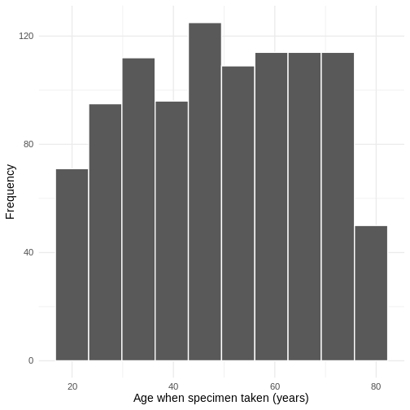
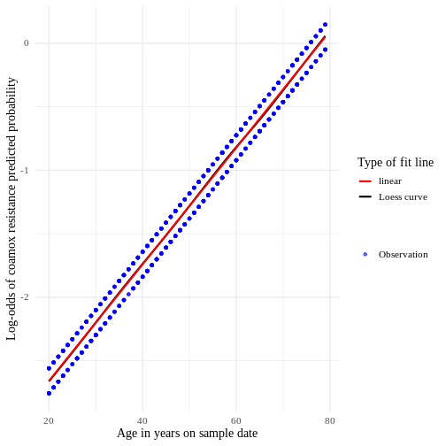

::::::::::::::::::::::::::::::::::::::: objectives

- To be able to construct regression models for a binary outcome
- To be able to calculate predicted variables and residuals

::::::::::::::::::::::::::::::::::::::::::::::::::

:::::::::::::::::::::::::::::::::::::::: questions

- How can I identify factors for antibiotic resistance?
- How can I check the validity of model?

::::::::::::::::::::::::::::::::::::::::::::::::::

## Content

-   Exploratory Data Analysis
-   Model Creation and Estimation
-   Reporting the Logistic Regression Results

## Data


``` r
# We will need these libraries and this data later.
library(aod)
library(broom)
library(ggplot2)
library(lubridate)
library(odds.n.ends)
library(tidyverse)

amrData <- read.csv("data/dig_health_hub_amr_v2.csv")
```
The data used in this episode was provided by Simon Thelwall from the UKHSA.
It has been created to represent the sort of data that might be obtained from the Second Generation Surveillance System (SGSS).
The data has 1000 rows of 13 variables.

## Exploratory Data Analysis

We can preview our data by using 'head':


``` r
head(amrData)
```

``` output
  id        dob  spec_date sex_male had_surgery_past_yr          ethnicity imd
1  1 1981-04-04 2014-05-25        1                   0 Other ethnic group   4
  organism coamox cipro gentam trst_cd icd_cd
1  E. coli      1     0      0     R1L   R450
 [ reached 'max' / getOption("max.print") -- omitted 5 rows ]
```
We can also request information about variable names and data types:

``` r
sapply(amrData, class)
```

``` output
                 id                 dob           spec_date            sex_male 
          "integer"         "character"         "character"           "integer" 
had_surgery_past_yr           ethnicity                 imd            organism 
          "integer"         "character"           "integer"         "character" 
             coamox               cipro              gentam             trst_cd 
          "integer"           "integer"           "integer"         "character" 
             icd_cd 
        "character" 
```

We can see that dates are currently stored as the char data type. We also do not know the age of the participant when the sample was taken.


``` r
# Calculate age (in years) as of their last birthday and add as an additional variable to our data.
# The %--% and %/% are synax specific to lubridate.
# In the first part we are asking it to find the difference between the two dates.
# We are then rounding down to the nearest year.

amrData <- amrData %>%
  mutate(
    age_years_sd = (dob %--% spec_date) %/% years(1)
  )
```

We can also convert 'spec_date', the date the specimen was taken from text to a date:

``` r
# Convert char to date and store as additional variable
amrData <- amrData %>%
  mutate(
    spec_date_YMD = as.Date(amrData$spec_date)
  )
```
We can use a histogram to explore the age distribution of the participants:


``` r
# histogram of age
ageHisto <- amrData %>%
  ggplot(aes(x = age_years_sd)) +
  geom_histogram(bins = 10, color = "white") +
  theme_minimal(base_size = 14, base_family = "sans") +
  labs(x = "Age when specimen taken (years)", y = "Frequency")
ageHisto
```


We can also look at where the specimens were processed:

``` r
xtabs(~trst_cd, data = amrData)
```

``` output
trst_cd
R0A R1A R1C R1D R1E R1F R1G R1H R1J R1K R1L RA2 RA3 RA4 RA7 RA9 RAE RAJ RAL RAN 
  2   7   7   2   4   2   2   3   7   3   4   9   9   4   3   1   2   4   4   1 
RAP RAS RAT RAX RBA 
  2   1   3   1   5 
 [ reached 'max' / getOption("max.print") -- omitted 213 entries ]
```

and for which organism:

``` r
xtabs(~organism, data = amrData)
```

``` output
organism
E. coli 
   1000 
```

In addition, we can use cross-tabulation to identify if the specimen indicated resistance to one or more of Coamoxiclav, Gentamicin and Ciprofloxacin for the participants:


``` r
xtabs(~ coamox + cipro + gentam, data = amrData)
```

``` output
, , gentam = 0

      cipro
coamox   0   1
     0 666  61
     1 207  25

, , gentam = 1

      cipro
coamox   0   1
     0  29   3
     1   9   0
```
Coamoxiclav appears to have the highest individual indication of resistance. We will explore indicators to Coamoxiclav first.

##  Model Creation and Estimation

As the dependent variable we want to explore is binary (0,1), we will use a binomial generalised linear model.


``` r
coamox_logit <- glm(coamox ~ age_years_sd + sex_male, data = amrData, family = "binomial")

summary(coamox_logit)
```

``` output

Call:
glm(formula = coamox ~ age_years_sd + sex_male, family = "binomial", 
    data = amrData)

Coefficients:
              Estimate Std. Error z value Pr(>|z|)    
(Intercept)  -3.674495   0.304302 -12.075   <2e-16 ***
age_years_sd  0.045885   0.005012   9.155   <2e-16 ***
sex_male      0.196694   0.155786   1.263    0.207    
---
Signif. codes:  0 '***' 0.001 '**' 0.01 '*' 0.05 '.' 0.1 ' ' 1

(Dispersion parameter for binomial family taken to be 1)

    Null deviance: 1104.5  on 999  degrees of freedom
Residual deviance: 1006.2  on 997  degrees of freedom
AIC: 1012.2

Number of Fisher Scoring iterations: 4
```
In this initial model focusing on demographic indicators, age at time of sample being taken seems to be statistically significant but, whether or not the participant is male both does not.

age_years_sd: For every unit increase in age_years_sd the log-odds of Coamoxiclav resistance increase by 0.0404280.

sex_male: The difference in the log-odds of Coamoxiclav resistance between males and non-males is 0.196694.

Older participants have higher log-odds of Coamoxicalv resistance.

::::::::::::::::::::::::::::::::::::::  callout

If both age_years_sd and sex_male had indicated statistical significance we would want to check whether 
these were significant independently or if there was a relationship between the two variables.

We can check to see that our indicators sex_male and age_years_sd are independent:

``` r
# check VIF for no perfect multicollinearity assumption
car::vif(coamox_logit)
```

``` output
age_years_sd     sex_male 
    1.000711     1.000711 
```
We can also check the linearity of the variable age_years_sd


``` r
# make a variable of the logit of the predicted values
logit.use <- log(coamox_logit$fitted.values / (1 - coamox_logit$fitted.values))

# make a small data frame with the logit variable and the age predictor
linearity_data <- data.frame(logit.use, age = coamox_logit$model$age_years_sd)

# create a plot with linear and actual relationships shown
ggplot(linearity_data, aes(x = age, y = logit.use)) +
  geom_point(aes(size = "Observation"), color = "blue", alpha = .6) +
  geom_smooth(aes(color = "Loess curve"), se = FALSE) +
  geom_smooth(aes(color = "linear"), method = lm, se = FALSE) +
  theme_minimal(base_size = 14, base_family = "serif") +
  labs(x = "Age in years on sample date", y = "Log-odds of coamox resistance predicted probability") +
  scale_color_manual(name = "Type of fit line", values = c("red", "black")) +
  scale_size_manual(values = 1.5, name = "")
```

``` output
`geom_smooth()` using method = 'gam' and formula = 'y ~ s(x, bs = "cs")'
`geom_smooth()` using formula = 'y ~ x'
```



::::::::::::::::::::::::::::::::::::::::::::::::::

::::::::::::::::::::::::::::::::::::::  challenge

### Challenge 1

Update the model coamox_logit to include had_surgery_past_yr as an independent variable.
What is the log-odds reported and is it statistically significant?

:::::::::::::::  solution

### Challenge 1

You may choose to create a new glm:


``` r
coamox_surg_logit <- glm(coamox ~ age_years_sd + sex_male + had_surgery_past_yr, data = amrData, family = "binomial")

summary(coamox_surg_logit)
```

``` output

Call:
glm(formula = coamox ~ age_years_sd + sex_male + had_surgery_past_yr, 
    family = "binomial", data = amrData)

Coefficients:
                     Estimate Std. Error z value Pr(>|z|)    
(Intercept)         -3.669669   0.304683 -12.044   <2e-16 ***
age_years_sd         0.045950   0.005018   9.158   <2e-16 ***
sex_male             0.196501   0.155795   1.261    0.207    
had_surgery_past_yr -0.082709   0.260036  -0.318    0.750    
---
Signif. codes:  0 '***' 0.001 '**' 0.01 '*' 0.05 '.' 0.1 ' ' 1

(Dispersion parameter for binomial family taken to be 1)

    Null deviance: 1104.5  on 999  degrees of freedom
Residual deviance: 1006.1  on 996  degrees of freedom
AIC: 1014.1

Number of Fisher Scoring iterations: 4
```
had_surgery_past_yr: The difference in the log-odds of Coamoxiclav resistance between those who have had surgery in the past year
and those who have not is -0.082709. It is not statistically significant.

You may also want to check for multicollinearity:


``` r
car::vif(coamox_surg_logit)
```

``` output
       age_years_sd            sex_male had_surgery_past_yr 
           1.002580            1.000724            1.001887 
```
As the value of GVIF is lower than 4, it suggests that the assumption of independence between the variables is held.

:::::::::::::::::::::::::

::::::::::::::::::::::::::::::::::::::::::::::::::


### Incorporating a multi-level factor

We are going to incorporate ethnicity into our model. We first need to conver this to a factor, to make sure it is
interpreted as a categorical variable.


``` r
amrData$ethnicity <- factor(amrData$ethnicity)

coamox_surg_ethnicity_logit <- glm(
  coamox ~ age_years_sd + sex_male + had_surgery_past_yr + ethnicity,
  data = amrData,
  family = "binomial"
)

summary(coamox_surg_ethnicity_logit)
```

``` output

Call:
glm(formula = coamox ~ age_years_sd + sex_male + had_surgery_past_yr + 
    ethnicity, family = "binomial", data = amrData)

Coefficients:
                                                                  Estimate
(Intercept)                                                      -3.647120
age_years_sd                                                      0.046052
sex_male                                                          0.198869
had_surgery_past_yr                                              -0.118937
ethnicityBlack, Black British, Black Welsh, Caribbean or African -0.018563
                                                                 Std. Error
(Intercept)                                                        0.343281
age_years_sd                                                       0.005033
sex_male                                                           0.156156
had_surgery_past_yr                                                0.262383
ethnicityBlack, Black British, Black Welsh, Caribbean or African   0.241202
                                                                 z value
(Intercept)                                                      -10.624
age_years_sd                                                       9.150
sex_male                                                           1.274
had_surgery_past_yr                                               -0.453
ethnicityBlack, Black British, Black Welsh, Caribbean or African  -0.077
                                                                 Pr(>|z|)    
(Intercept)                                                        <2e-16 ***
age_years_sd                                                       <2e-16 ***
sex_male                                                            0.203    
had_surgery_past_yr                                                 0.650    
ethnicityBlack, Black British, Black Welsh, Caribbean or African    0.939    
 [ reached 'max' / getOption("max.print") -- omitted 3 rows ]
---
Signif. codes:  0 '***' 0.001 '**' 0.01 '*' 0.05 '.' 0.1 ' ' 1

(Dispersion parameter for binomial family taken to be 1)

    Null deviance: 1104.5  on 999  degrees of freedom
Residual deviance: 1003.1  on 992  degrees of freedom
AIC: 1019.1

Number of Fisher Scoring iterations: 4
```
The ethnicity category Asian, Asian British or Asian Welsh has been used as the reference group.
Estimates for the other categories are reported in relation to this group.

We can use the Wald test to explore the overall effect of ethnicity. We will use the `wald.test` function of the `aod` library. The order in which the coefficients are given in the table of coefficients is the same as the order of the terms in the model. This is important because the `wald.test` function refers to the coefficients by their order in the model. 
`b` supplies the coefficients, while `Sigma` supplies the variance covariance matrix of the error terms, finally `Terms` tells R which terms in the model are to be tested, in this case, terms 5 to 8, which correspond to the different ehtnicities.


``` r
wald.test(b = coef(coamox_surg_ethnicity_logit), Sigma = vcov(coamox_surg_ethnicity_logit), Terms = 5:8)
```

``` output
Wald test:
----------

Chi-squared test:
X2 = 3.0, df = 4, P(> X2) = 0.56
```

The chi-squared test statistic of 3, with 4 degrees of freedom is associated with a p-value of 0.56 indicating that the overall effect of ethnicity is not statistically significant.


## Reporting the Logistic Regression Results

For our model `coamox_surg_ethnicity_logit` there are various things that we can report, and different functions and packages that can be used.

We can report the confidence intervals using profiled log-likelihood or using standard errors for our model.


``` r
# CIs using log-likelihood
confint(coamox_surg_ethnicity_logit)
```

``` output
Waiting for profiling to be done...
```

``` output
                                                                       2.5 %
(Intercept)                                                      -4.33800225
age_years_sd                                                      0.03636433
sex_male                                                         -0.10674027
had_surgery_past_yr                                              -0.64993004
ethnicityBlack, Black British, Black Welsh, Caribbean or African -0.49214180
ethnicityMixed or Multiple ethnic groups                         -0.74511271
ethnicityOther ethnic group                                      -0.53052232
ethnicityWhite                                                   -0.28693861
                                                                      97.5 %
(Intercept)                                                      -2.99099188
age_years_sd                                                      0.05611302
sex_male                                                          0.50590182
had_surgery_past_yr                                               0.38234698
ethnicityBlack, Black British, Black Welsh, Caribbean or African  0.45498119
ethnicityMixed or Multiple ethnic groups                          0.24933436
ethnicityOther ethnic group                                       0.41138135
ethnicityWhite                                                    0.68348370
```

``` r
## CIs using standard errors
confint.default(coamox_surg_ethnicity_logit)
```

``` output
                                                                      2.5 %
(Intercept)                                                      -4.3199389
age_years_sd                                                      0.0361877
sex_male                                                         -0.1071904
had_surgery_past_yr                                              -0.6331983
ethnicityBlack, Black British, Black Welsh, Caribbean or African -0.4913098
ethnicityMixed or Multiple ethnic groups                         -0.7414219
ethnicityOther ethnic group                                      -0.5296482
ethnicityWhite                                                   -0.2861631
                                                                      97.5 %
(Intercept)                                                      -2.97430034
age_years_sd                                                      0.05591587
sex_male                                                          0.50492858
had_surgery_past_yr                                               0.39532488
ethnicityBlack, Black British, Black Welsh, Caribbean or African  0.45418449
ethnicityMixed or Multiple ethnic groups                          0.25095531
ethnicityOther ethnic group                                       0.41067371
ethnicityWhite                                                    0.68258376
```

Alternatively we may be interested in the odds-ratio:


``` r
## odds ratios only
exp(coef(coamox_surg_ethnicity_logit))
```

``` output
                                                     (Intercept) 
                                                       0.0260661 
                                                    age_years_sd 
                                                       1.0471286 
                                                        sex_male 
                                                       1.2200222 
                                             had_surgery_past_yr 
                                                       0.8878640 
ethnicityBlack, Black British, Black Welsh, Caribbean or African 
                                                       0.9816086 
                        ethnicityMixed or Multiple ethnic groups 
                                                       0.7825220 
                                     ethnicityOther ethnic group 
                                                       0.9422476 
                                                  ethnicityWhite 
                                                       1.2192188 
```

``` r
# including confidence intervals
exp(cbind(OR = coef(coamox_surg_ethnicity_logit), confint(coamox_surg_ethnicity_logit)))
```

``` output
Waiting for profiling to be done...
```

``` output
                                                                        OR
(Intercept)                                                      0.0260661
age_years_sd                                                     1.0471286
sex_male                                                         1.2200222
had_surgery_past_yr                                              0.8878640
ethnicityBlack, Black British, Black Welsh, Caribbean or African 0.9816086
ethnicityMixed or Multiple ethnic groups                         0.7825220
ethnicityOther ethnic group                                      0.9422476
ethnicityWhite                                                   1.2192188
                                                                     2.5 %
(Intercept)                                                      0.0130626
age_years_sd                                                     1.0370336
sex_male                                                         0.8987591
had_surgery_past_yr                                              0.5220823
ethnicityBlack, Black British, Black Welsh, Caribbean or African 0.6113157
ethnicityMixed or Multiple ethnic groups                         0.4746808
ethnicityOther ethnic group                                      0.5882976
ethnicityWhite                                                   0.7505578
                                                                     97.5 %
(Intercept)                                                      0.05023758
age_years_sd                                                     1.05771722
sex_male                                                         1.65848049
had_surgery_past_yr                                              1.46572057
ethnicityBlack, Black British, Black Welsh, Caribbean or African 1.57614373
ethnicityMixed or Multiple ethnic groups                         1.28317100
ethnicityOther ethnic group                                      1.50890067
ethnicityWhite                                                   1.98076612
```
These can also be presented using broom:


``` r
# as Log-Odds
tidy(coamox_surg_ethnicity_logit)
```

``` output
# A tibble: 8 × 5
  term                                     estimate std.error statistic  p.value
  <chr>                                       <dbl>     <dbl>     <dbl>    <dbl>
1 (Intercept)                               -3.65     0.343    -10.6    2.30e-26
2 age_years_sd                               0.0461   0.00503    9.15   5.67e-20
3 sex_male                                   0.199    0.156      1.27   2.03e- 1
4 had_surgery_past_yr                       -0.119    0.262     -0.453  6.50e- 1
5 ethnicityBlack, Black British, Black We…  -0.0186   0.241     -0.0770 9.39e- 1
6 ethnicityMixed or Multiple ethnic groups  -0.245    0.253     -0.969  3.33e- 1
7 ethnicityOther ethnic group               -0.0595   0.240     -0.248  8.04e- 1
8 ethnicityWhite                             0.198    0.247      0.802  4.23e- 1
```

``` r
# as ORs
tidy(coamox_surg_ethnicity_logit, exp = TRUE)
```

``` output
# A tibble: 8 × 5
  term                                     estimate std.error statistic  p.value
  <chr>                                       <dbl>     <dbl>     <dbl>    <dbl>
1 (Intercept)                                0.0261   0.343    -10.6    2.30e-26
2 age_years_sd                               1.05     0.00503    9.15   5.67e-20
3 sex_male                                   1.22     0.156      1.27   2.03e- 1
4 had_surgery_past_yr                        0.888    0.262     -0.453  6.50e- 1
5 ethnicityBlack, Black British, Black We…   0.982    0.241     -0.0770 9.39e- 1
6 ethnicityMixed or Multiple ethnic groups   0.783    0.253     -0.969  3.33e- 1
7 ethnicityOther ethnic group                0.942    0.240     -0.248  8.04e- 1
8 ethnicityWhite                             1.22     0.247      0.802  4.23e- 1
```

The odd.n.ends package provides a wide range of reporting tools


``` r
# Odds ratios and confidence intervals
coamox_surg_ethnicity_logitOR <- odds.n.ends::odds.n.ends(coamox_surg_ethnicity_logit)
```

``` output
Waiting for profiling to be done...
```

``` r
coamox_surg_ethnicity_logitCI <- coamox_surg_ethnicity_logitOR$`Predictor odds ratios and 95% CI`
coamox_surg_ethnicity_logitCI
```

``` output
                                                                        OR
(Intercept)                                                      0.0260661
age_years_sd                                                     1.0471286
sex_male                                                         1.2200222
had_surgery_past_yr                                              0.8878640
ethnicityBlack, Black British, Black Welsh, Caribbean or African 0.9816086
ethnicityMixed or Multiple ethnic groups                         0.7825220
ethnicityOther ethnic group                                      0.9422476
ethnicityWhite                                                   1.2192188
                                                                     2.5 %
(Intercept)                                                      0.0130626
age_years_sd                                                     1.0370336
sex_male                                                         0.8987591
had_surgery_past_yr                                              0.5220823
ethnicityBlack, Black British, Black Welsh, Caribbean or African 0.6113157
ethnicityMixed or Multiple ethnic groups                         0.4746808
ethnicityOther ethnic group                                      0.5882976
ethnicityWhite                                                   0.7505578
                                                                     97.5 %
(Intercept)                                                      0.05023758
age_years_sd                                                     1.05771722
sex_male                                                         1.65848049
had_surgery_past_yr                                              1.46572057
ethnicityBlack, Black British, Black Welsh, Caribbean or African 1.57614373
ethnicityMixed or Multiple ethnic groups                         1.28317100
ethnicityOther ethnic group                                      1.50890067
ethnicityWhite                                                   1.98076612
```

``` r
# model fit
modfit <- coamox_surg_ethnicity_logitOR$`Count R-squared (model fit): percent correctly predicted`
modfit
```

``` output
[1] 75.6
```

``` r
# Other model statistics
odds.n.ends::odds.n.ends(coamox_surg_ethnicity_logit)
```

``` output
Waiting for profiling to be done...
```

``` output
$`Logistic regression model significance`
Chi-squared        d.f.           p 
    101.338           7       <.001 

$`Contingency tables (model fit): frequency predicted`
                Number observed
Number predicted    1    0  Sum
             1     15   18   33
             0    226  741  967
             Sum  241  759 1000

$`Count R-squared (model fit): percent correctly predicted`
[1] 75.6

$`Model sensitivity`
[1] 0.06224066

$`Model specificity`
[1] 0.9762846

$`Predictor odds ratios and 95% CI`
                                                                        OR
(Intercept)                                                      0.0260661
age_years_sd                                                     1.0471286
sex_male                                                         1.2200222
had_surgery_past_yr                                              0.8878640
ethnicityBlack, Black British, Black Welsh, Caribbean or African 0.9816086
ethnicityMixed or Multiple ethnic groups                         0.7825220
ethnicityOther ethnic group                                      0.9422476
ethnicityWhite                                                   1.2192188
                                                                     2.5 %
(Intercept)                                                      0.0130626
age_years_sd                                                     1.0370336
sex_male                                                         0.8987591
had_surgery_past_yr                                              0.5220823
ethnicityBlack, Black British, Black Welsh, Caribbean or African 0.6113157
ethnicityMixed or Multiple ethnic groups                         0.4746808
ethnicityOther ethnic group                                      0.5882976
ethnicityWhite                                                   0.7505578
                                                                     97.5 %
(Intercept)                                                      0.05023758
age_years_sd                                                     1.05771722
sex_male                                                         1.65848049
had_surgery_past_yr                                              1.46572057
ethnicityBlack, Black British, Black Welsh, Caribbean or African 1.57614373
ethnicityMixed or Multiple ethnic groups                         1.28317100
ethnicityOther ethnic group                                      1.50890067
ethnicityWhite                                                   1.98076612
```
As you can see we have a range of probabilities, odds ratios and log-odds. We need to be aware of which we are referring to.
One way is to look at the range of the estimates. Probabilities always have a range from zero to 1. Logit units generally range from about -4 to +4, with zero meaning an equal probability of no event or the event outcome occurring. Odds ratios can range from very small (but positive) numbers to very large positive numbers.

These odds ratios versions of the estimates are more easily interpreted than logit scores. Odds ratios of less than one means that an increase in that predictor makes the outcome less likely to occur, and an odds ratio of greater than one means that an increase in that predictor makes the outcome more likely to occur.

::::::::::::::::::::::::::::::::::::::: discussion

## Discussion

* What other indicators could we have included in our model?
* What question(s) would they help us to answer?

::::::::::::::::::::::::::::::::::::::::::::::::::

:::::::::::::::::::::::::::::::::::::::  challenge

## Challenge 3

We have explored potential indicators of Coamoxiclav resistance.

Explore potential indicators of either Gentamicin or Ciprofloxacin resistance.


::::::::::::::::::::::::::::::::::::::::::::::::::

:::::::::::::::::::::::::::::::::::::::  keypoints

* Logistic regression models the log-odds of an event as a linear combination of 
one or more independent variables.

* Binary logistic regression, where  a single binary dependent variable, 
coded by an indicator variable, where the two values are labeled "0" and "1", 
can be used to model the probability of a certain class or event taking place. 
In these examples, antimicrobial resistance to a particular antibiotic.

::::::::::::::::::::::::::::::::::::::::::::::::::
