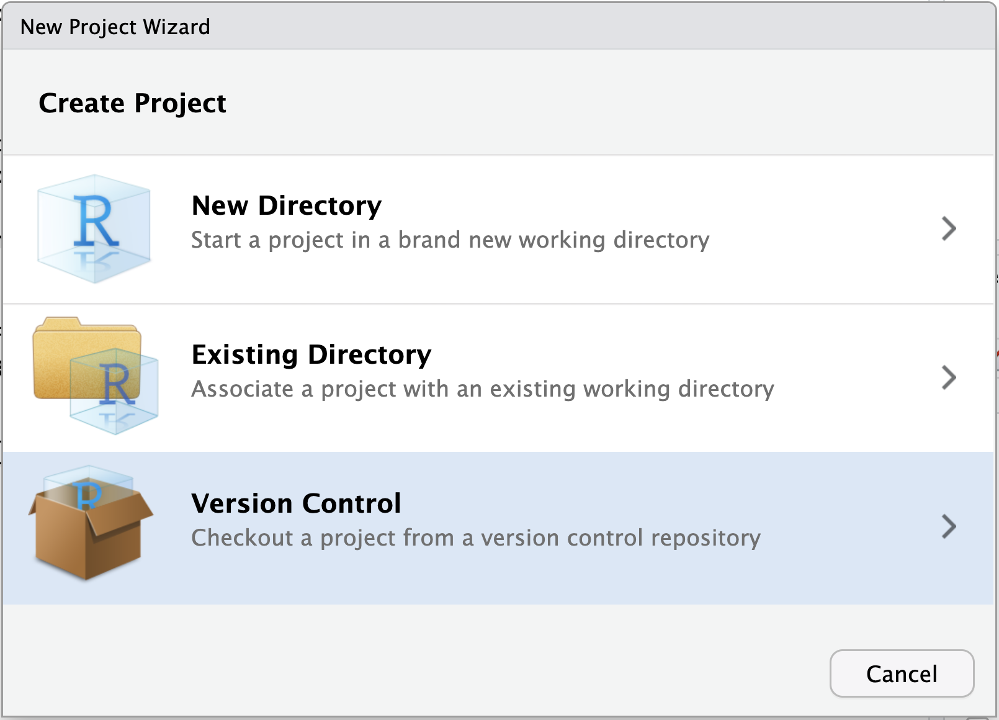
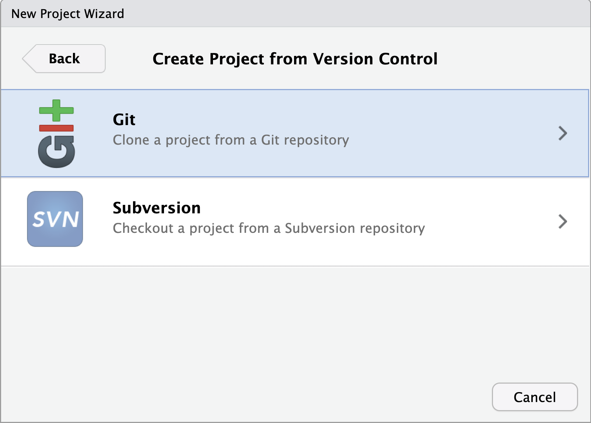
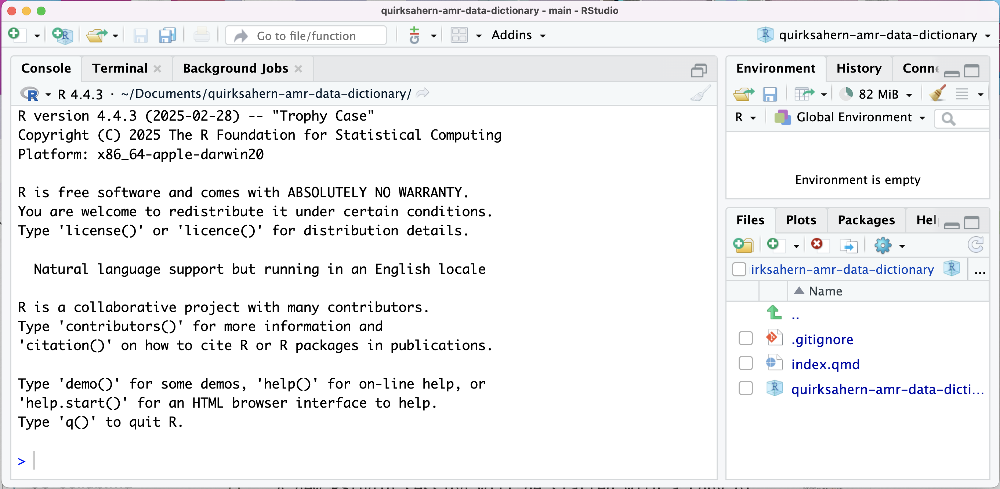
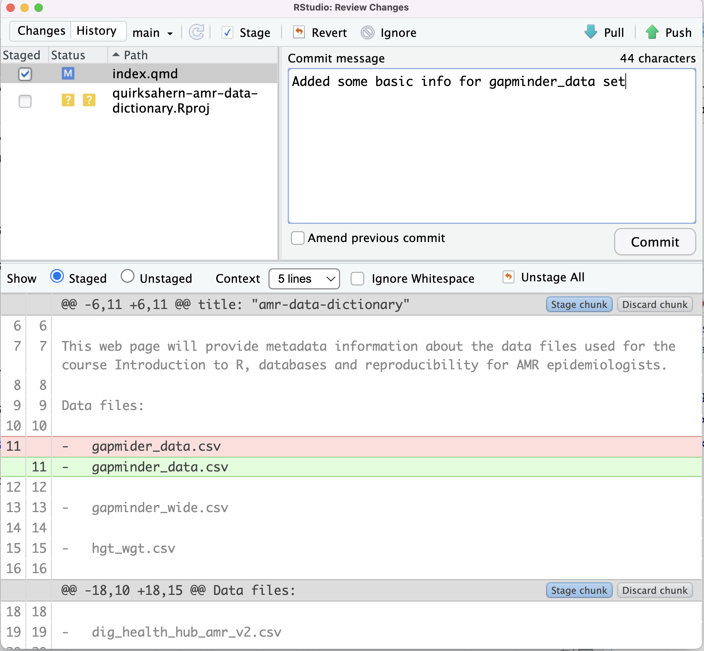
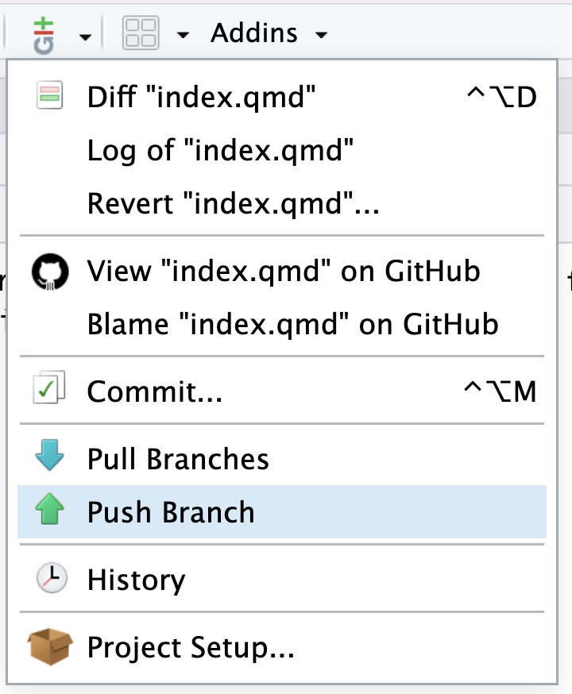
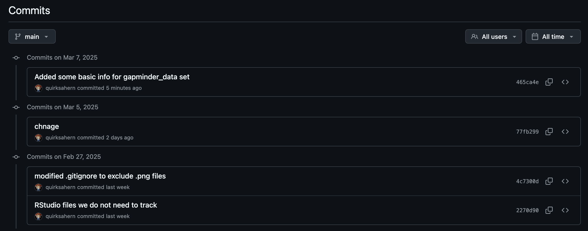
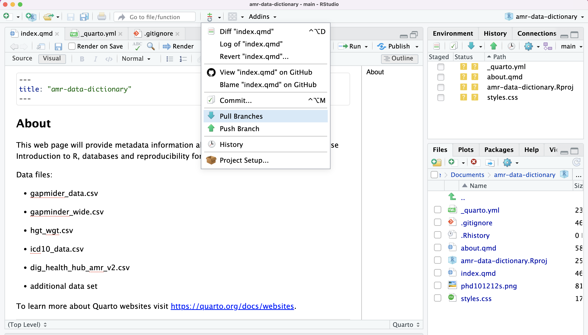

::::::::::::::::::::::::::::::::::::::: objectives

- Clone a remote repository.
- Collaborate by pushing to a common repository.
- Describe the basic collaborative workflow.

::::::::::::::::::::::::::::::::::::::::::::::::::

:::::::::::::::::::::::::::::::::::::::: questions

- How can I use version control to collaborate with other people?

::::::::::::::::::::::::::::::::::::::::::::::::::

For the next step, get into pairs.  One person will be the "Owner" and the other
will be the "Collaborator". The goal is that the Collaborator add changes into
the Owner's repository. We will switch roles at the end, so both persons will
play Owner and Collaborator.

:::::::::::::::::::::::::::::::::::::::::  callout

## Practicing By Yourself

If you're working through this lesson on your own, you can carry on by opening
a second terminal window.
This window will represent your partner, working on another computer. You
won't need to give anyone access on GitHub, because both 'partners' are you.


::::::::::::::::::::::::::::::::::::::::::::::::::

The Owner needs to give the Collaborator access. In your repository page on GitHub, click the "Settings"
button on the right, select "Collaborators", click "Add people", and
then enter your partner's username.

{alt='A screenshot of the GitHub Collaborators settings page, which is accessed by clicking "Settings" then "Collaborators"'}

To accept access to the Owner's repo, the Collaborator
needs to go to [https://github.com/notifications](https://github.com/notifications)
or check for email notification. Once there she can accept access to the Owner's repo.

Next, the Collaborator needs to download a copy of the Owner's repository to her
machine. This is called "cloning a repo".

The Collaborator doesn't want to overwrite her own version of `amr-data-dictionary.git`, so
needs to clone the Owner's repository to a different location than her own
repository with the same name.

{alt='A screenshot of RStudio New Project wizard dialogue box showing the threee options available'}

We will create a `New Project` and select `Version Control`.

{alt='A screenshot of RStudio New Project wizard dialogue box showing Git and SVN as options'}

We want to clone a Git repository.

{alt='A screenshot of RStudio New Project wizard dialogue box showing Git repository information required'}

After selecting Git, we need to provide information about the project we want to clone. 

{alt='A screenshot of GitHub showing clone URL'}

The URL information can be found in GitHub. We need to copy the `HTTPS` URL and paste into the `Repository URL` box.

{alt='A screenshot of RStudio dialogue box showing completed details of repo to be cloned.'}

We would then give the new project a meaningful name. In this case it's the owner of the respository's name and amr-data-dictionary. Replace quirksahern with the owner's name. It is recommended that new projects are started in new R sessions. So check the `Open in new session` box and `Create Project`.

{alt='A screenshot of RStudio dialogue box showing completed details of repo to be cloned.'}

A new RStudio session will be started with a copy of the files from the cloned repository.

{alt='A diagram showing that "git clone" can create a copy of a remote GitHub repository, allowing a second person to create their own local repository that they can make changes to.'}

The Collaborator can now make a change in her clone of the Owner's repository,
exactly the same way as we've been doing before. Let's update `index.qmd`.

{alt='A screenshot of RStudio showing amendments to index.qmd.'}

Then commit our changes locally.

{alt='A screenshot of RStudio showing commit window and meesage for amended file.'}

Then push the change to the *Owner's repository* on GitHub:

{alt='A screenshot of RStudio showing commit window and meesage for amended file.'}

Note that we didn't have to create a remote called `origin`: Git uses this
name by default when we clone a repository.  (This is why `origin` was a
sensible choice earlier when we were setting up remotes by hand.)

{alt='A screenshot of GitHub showing the commit history of the cloned repo, and showing latest `push`'}

Take a look at the Owner's repository on GitHub again, and you should be
able to see the new commit made by the Collaborator. You may need to refresh
your browser to see the new commit.

:::::::::::::::::::::::::::::::::::::::::  callout

## Some more about remotes

In this episode and the previous one, our local repository has had
a single "remote", called `origin`. A remote is a copy of the repository
that is hosted somewhere else, that we can push to and pull from, and
there's no reason that you have to work with only one. For example,
on some large projects you might have your own copy in your own GitHub
account (you'd probably call this `origin`) and also the main "upstream"
project repository (let's call this `upstream` for the sake of examples).
You would pull from `upstream` from time to
time to get the latest updates that other people have committed.

Remember that the name you give to a remote only exists locally. It's
an alias that you choose - whether `origin`, or `upstream`, or `quirksahern` -
and not something intrinstic to the remote repository.

The `git remote` family of commands is used to set up and alter the remotes
associated with a repository. Here are some of the most useful ones:

- `git remote -v` lists all the remotes that are configured (we already used
  this in the last episode)
- `git remote add [name] [url]` is used to add a new remote
- `git remote remove [name]` removes a remote. Note that it doesn't affect the
  remote repository at all - it just removes the link to it from the local repo.
- `git remote set-url [name] [newurl]` changes the URL that is associated
  with the remote. This is useful if it has moved, e.g. to a different GitHub
  account, or from GitHub to a different hosting service. Or, if we made a typo when
  adding it!
- `git remote rename [oldname] [newname]` changes the local alias by which a remote
  is known - its name. For example, one could use this to change `upstream` to `alfred`.
  

::::::::::::::::::::::::::::::::::::::::::::::::::
{alt='A screenshot of RStudio showing owner's file and Pull option'}

To download the Collaborator's changes from GitHub, the Owner now `Pull`s and saves the changes.

```
>>> /usr/bin/git pull
From github.com:quirksahern/amr-data-dictionary
   77fb299..465ca4e  main       -> origin/main
Updating 77fb299..465ca4e
Fast-forward
 index.qmd | 15 ++++++++++-----
 1 file changed, 10 insertions(+), 5 deletions(-)
 ```

Now the three repositories (Owner's local, Collaborator's local, and Owner's on
GitHub) are back in sync.

:::::::::::::::::::::::::::::::::::::::::  callout

## A Basic Collaborative Workflow

In practice, it is good to be sure that you have an updated version of the
repository you are collaborating on, so you should `git pull` before making
our changes. The basic collaborative workflow would be:

- update your local repo with `Pull`,
- make your changes and stage them with `Staged`,
- commit your changes with `Commit`, and
- upload the changes to GitHub with `Push`

It is better to make many commits with smaller changes rather than
of one commit with massive changes: small commits are easier to
read and review.


::::::::::::::::::::::::::::::::::::::::::::::::::

:::::::::::::::::::::::::::::::::::::::  challenge

## Switch Roles and Repeat

Switch roles and repeat the whole process.


::::::::::::::::::::::::::::::::::::::::::::::::::

:::::::::::::::::::::::::::::::::::::::  challenge

## Review Changes

The Owner pushed commits to the repository without giving any information
to the Collaborator. How can the Collaborator find out what has changed with
the Terminal? And on GitHub?

:::::::::::::::  solution

## Solution

On the command line, the Collaborator can use `git fetch origin main`
to get the remote changes into the local repository, but without merging
them. Then by running `git diff main origin/main` the Collaborator
will see the changes output in the terminal.

On GitHub, the Collaborator can go to the repository and click on
"commits" to view the most recent commits pushed to the repository.


:::::::::::::::::::::::::

::::::::::::::::::::::::::::::::::::::::::::::::::

:::::::::::::::::::::::::::::::::::::::  challenge

## Comment Changes in GitHub

The Collaborator has some questions about one line change made by the Owner and
has some suggestions to propose.

With GitHub, it is possible to comment on the diff of a commit. Over the line of
code to comment, a blue comment icon appears to open a comment window.

The Collaborator posts her comments and suggestions using the GitHub interface.


::::::::::::::::::::::::::::::::::::::::::::::::::

:::::::::::::::::::::::::::::::::::::::  challenge

## Version History, Backup, and Version Control

Some backup software can keep a history of the versions of your files. They also
allows you to recover specific versions. How is this functionality different from version control?
What are some of the benefits of using version control, Git and GitHub?


::::::::::::::::::::::::::::::::::::::::::::::::::

:::::::::::::::::::::::::::::::::::::::: keypoints

- `git clone` copies a remote repository to create a local repository with a remote called `origin` automatically set up.

::::::::::::::::::::::::::::::::::::::::::::::::::
