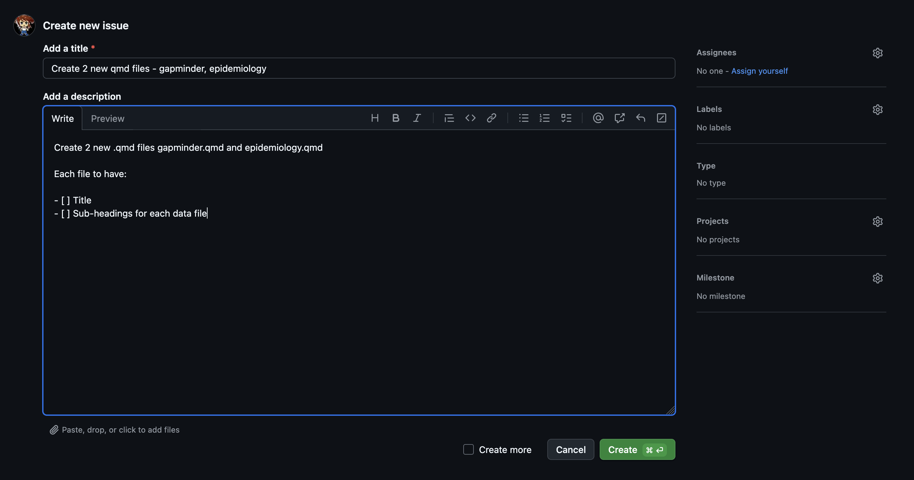
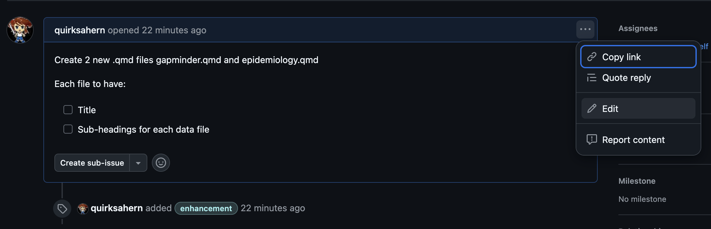

::::::::::::::::::::::::::::::::::::::: objectives

- Explain why you might want to use Issues.
- Create an Issue.
- Explain the relationship between Issues and Branches

::::::::::::::::::::::::::::::::::::::::::::::::::

:::::::::::::::::::::::::::::::::::::::: questions

- How do I specify a change that needs to be made to a file(s)?

::::::::::::::::::::::::::::::::::::::::::::::::::

Issues are a feature within GitHub that enables to create a to-do list of tasks for our project. Issues can be used to specify a new feature to be created,describe an issue to be fixed or to provide feedback and share ideas.

They have a number of features that can be used to help you manage a project and can be assigned to to individuals or groups.

## Creating an Issue

We can view any existing issues or create a new one via `Issues` on the GitHub toolbar.

{alt='GH screenshot showing Issues'}

There are currently no open issues, to create new `Issue` click on `New issue`.

{alt='GH screenshot showing definition of new issue'}

In the detail of the Issue we can specify our definition of 'done' for this task.

{alt='GH screenshot showing definition of new issue'}

We can also specify what type of task it is using the `Labels`, in this instance it is an `Enhancement`.

Once we are happy with our definition of the issue we can click on `Create`.

{alt='GH screenshot detail of newly opened issue'}

Our newly created `Issue` is now `Open`, and if appropriate we can `Create a branch` for the Issue.

:::::::::::::::::::::::::::::::::::::::::  callout

## Editing Issues

Issues are a live dialogue of the development or evolution of a task and ideas relating to your project.

They can be edited at any time, and even re-opened once closed if needed.

Dependent on need it is possible to edit both the Issue or individual comments within an Issue.

{alt='GH screenshot showing list of open issues'}

You can view all open issues through `Issues` on the GitHub toolbar. Click on an Issue to view details.

The `Edit` button will enable you to edit details of the Issue such as the issue name.

{alt='GH screenshot issue in edit mode'}

The Issue body or any comments can be edited by the the 3 dots `...`.

{alt='GH screenshot issue in edit mode'}

::::::::::::::::::::::::::::::::::::::::::::::::::

:::::::::::::::::::::::::::::::::::::::  challenge

## Create an Issue

Create a new Issue in your GitHub repository.

Can you assign yourself to the issue?

Can you create a new label?

::::::::::::::::::::::::::::::::::::::::::::::::::

## Closing an Issue

Sometimes an issue may be created that we learn is not needed. These can be deleted via `Delete issue`.

However, usually we choose to `Close issue`. We would choose to close an issue either after a task has been completed or a discussion has come to an end.

To close an issue:
- Open the issue to be closed, via `Issues`
- Enter a comment to explain why the Issue is to be closed
- Click on `Close issue`.

If a branch was created from the issue. The issue will automatically closed when the branch is merged.

Much more detailed information about creating and managing Issues is available via the GitHub documentation: [About issues](https://docs.github.com/en/issues/tracking-your-work-with-issues/about-issues)

:::::::::::::::::::::::::::::::::::::::: keypoints

- Issues can be used to plan, discuss, and track work.

::::::::::::::::::::::::::::::::::::::::::::::::::
