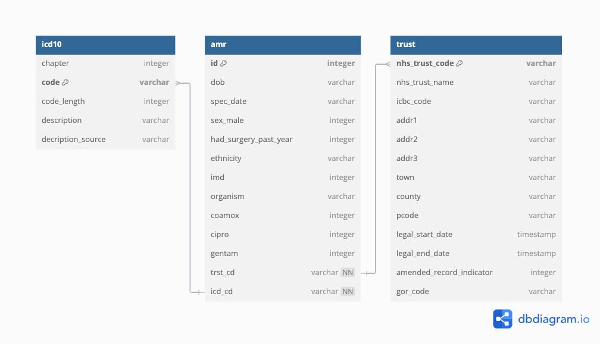

::::::::::::::::::::::::::::::::::::::: objectives

- Explain what SQL is and why to use it.
- Understand how SQL can be used to query databases
- Write queries that SELECT data based on conditions, such as AND, OR, and NOT and use of the WHERE clause.
- Use SQL functions like AVG in combination with clauses like Group By to aggregate values and make calculations on fields using SQL.
- Understand how to link tables together via joins.

::::::::::::::::::::::::::::::::::::::::::::::::::

:::::::::::::::::::::::::::::::::::::::: questions

- What is the relationship between a relational database and SQL?
- How do you query databases using SQL?
- How can I filter data?
- Can SQL be used to make calculations?
- How do I join two tables if they share a common point of information?

::::::::::::::::::::::::::::::::::::::::::::::::::

## Content

- Relational Databases - an overview
- Linking to a SQLite database
- Selecting data
- Filtering data
- Calculated fields and Aggregation
- Joining data

## Relational Databases - an overview

In this episode we will be using SQLite, a Relational Database Management Systems (RDBMS) within R.
We have chosen SQLite as it is an embedded RDBMS and does not rely on a connection to a server. 
It uses most of the SQL standard, and it is fully ACID compliant.

### Datbase structure

Relational databases consist of one or more tables of data. These tables have fields (columns) and records (rows). Every field has a data type. Every value in the same field of each record has the same type. 

{alt='Labelled image of a database table identifying Table, Field, Record and Value'}
These tables can be linked to each other when a field in one table can be matched to a field in another table. To enable this one column in each table is identified as a primary key. A primary key, often designated as PK, is one attribute of an entity that distinguishes it from the other entities (or records) in your table. The primary key must be unique for each row for this to work. A common way to create a primary key in a table is to make an ‘id’ field that contains an auto-generated integer that increases by 1 for each new record. This will ensure that your primary key is unique.

The relationship between tables can be represented by an Entity-Relationship Diagram.

#### Entity-Relationship Diagrams

The database that we will be using is represented in the diagram below:

{alt='E-R diagram showing the three tables of the database and the relationship between them'}
Relationships between entities and their attributes are represented by lines linking them together. For example, the line linking amr and trust is interpreted as follows: The ‘amr’ entity is related to the ‘trust’ entity through the attributes ‘trst_cd’ and ‘nhs_trust_code’ respectively.

Conceptually, we know that an individual test for antimicrobial resistance takes place is a single NHS trust but a NHS trust can be the location of many AMR tests. This is known as a one-to-many relationship. In modeling relationships, we usually assign a unique identifier to the ‘one’ side of the relationship and use that same identifier to refer to that entity on the ‘many’ side. 

In the ‘trust’ table, the ‘nhs_trust_code’ attribute is that unique identifier. We use that same identifier in the ‘amr’ table to refer to an individual trust. That way, there is an unambiguous way for us to distinguish which amr tests are associated with which nhs trust in a way that keeps the integrity of the data. Data is usually [normalised](https://en.wikipedia.org/wiki/Database_normalization) to avoid storing repeating data which may lead to errors.

There are 4 main types of relationships between tables:

- One to One - each item in the first table has exactly one match in the second table.
- One to Many - each item in the first table is related to many items in the second table, sometimes represented as 1 to * or 1 to ∞
- Many to One - many items in the first table is related to one item in the second table.
- Many to Many - many items in the first table are related to many items in the second table.

### What is SQL?

Structured Query Language, or SQL (sometimes pronounced "sequel"), is a powerful language used to interrogate and manipulate relational databases. It is not a general programming language that you can use to write an entire program. However, SQL queries can be called from programming languages to let any program interact with databases. There are several variants of SQL, but all support the same basic statements that we will be covering today.

### Why use SQL?

SQL is well established and has been around since the 1970s. It is still widely used in a variety of settings.

SQL lets you keep the data separate from the analysis. There is no risk of accidentally changing data when you are analysing it. If the data is updated, a saved query can be re-run to analyse the new data.

SQL is optimised for handling large amounts of data. Data types help quality control of entries - you will receive an error if you try to enter a word into a field that should contain a number.

## Creating a SQLite database

For creating and querying a SQLite database in R we will be using 2 additional packages, RSQLite and DBI.

```{r}
# As RSQLite uses functions defined in the DBI package, we load DBI first

library(DBI)
library(RSQLite)

```

We will be using synthetic data about AMR test samples, NHS trusts and ICD-10 classifications.

```{r}
# Import data initially to dataframes 
trusts <- read.csv('data/trust_data.csv')
icd10 <- read.csv('data/icd10_data.csv')
amrTests <- read.csv('data/dig_health_hub_amr_v2.csv')

```

We have a lot of information about the amrTests but we do not know the age of the participants when the samples were taken. So let's add an additional column to our data frame

```{r}
# Calculate age (in years) as of their last birthday and add as an additional variable to our data.
# The %--% and %/% are syntax specific to lubridate. 
# In the first part we are asking it to find the difference between the two dates.
# We are then rounding down to the nearest year.

library(tidyverse)
library(lubridate)

amrTests <- amrTests %>%
  mutate(
    age_years_sd = (dob %--% spec_date) %/% years(1)
  )
```

We can now connect to SQLite and create a new empty database:

```{r}

epiDB <- dbConnect(RSQLite::SQLite(), "epiDB.sqlite")

epiDB

```

and start adding our tables:

```{r}
#create tables

dbWriteTable(epiDB, "trusts", trusts)
dbWriteTable(epiDB, "icd10", icd10)
dbWriteTable(epiDB, "amrTests", amrTests)

dbListTables(epiDB)
```

## Selecting data

A query is a question or request for data. For example, "What are the ethnicities of the study participants?". 
When we query a database, we can ask the same question using Structured Query Language (SQL) in what is called a statement. 
Some of the most useful queries are used to return results from a table that match specific criteria.

The basic structure of a SQL query contains a `SELECT` statement indicating which columns are desired and a FROM clause explaining where to find them:

```{r}

dbGetQuery(epiDB, "SELECT ethnicity FROM amrTests LIMIT 10")

```
The string, "SELECT ethnicity FROM amrTest LIMIT 10" is a SQL query. 

SELECT is the statement, and it has the basic syntax of:

````
SELECT var1, var2 FROM table
````
We add an additional clause, `LIMIT 10` to reduce the amount of output.
This is useful when testing queries, especially when you have a large data set.

In the query above, we have capitalized the words `SELECT` and `FROM` because they are SQL keywords. Even though capitalization makes 
no difference to the SQL interpreter, capitalization of these SQL terms helps for readability and is therefore considered good style. 

As the data has repeating ethnicity values (`ethnicity`) due to a participants from a range of ethnic groups being tested for AMR resistance, we can specify unique values using `DISTINCT`:

```{r}

dbGetQuery(epiDB, "SELECT DISTINCT ethnicity FROM amrTests LIMIT 10")

```

We can expand our initial query to return `sex_male` in addition to `ethnicity`:

```{r}

dbGetQuery(epiDB, "SELECT ethnicity, sex_male FROM amrTests LIMIT 10")

```

We can also make use of the wildcard character '*' to select all Fields in a table:
```{r}

dbGetQuery(epiDB, "SELECT * FROM amrTests LIMIT 10")

```

### Sorting

We can also sort the results of our queries by using the keyword `ORDER BY`. 
Let's create a query that sorts the `trusts` table in ascending order by `nhs_trust_code` using the `ASC` keyword in conjunction with `ORDER BY`.
```{r}

dbGetQuery(epiDB, "SELECT * 
           FROM trusts 
           ORDER BY nhs_trust_code ASC
           LIMIT 10")

```
`ASC` is the default, so by omitting `ASC` or `DESC`, SQLite will sort ascending (ASC).

:::::::::::::::::::::::::::::::::::::::  challenge
## Challenge 1

Write a query that returns `Code`, `Description` and `DescriptionSource` from the `icd10` table, 
ordered by the `CodeLength` from highest to lowest value.

:::::::::::::::  solution
## Solution

```{r}
dbGetQuery(epiDB, "SELECT Code, Description, DescriptionSource
           FROM icd10 
           ORDER BY CodeLength DESC")
```

:::::::::::::::::::::::::

::::::::::::::::::::::::::::::::::::::::::::::::::

:::::::::::::::::::::::::::::::::::::::  callout

It is important to note that the output from our queries is not saved in the RStudio environment.
If needed, query results can be stored as data frames as dbGetQuery() returns the result of a query as a data frame.

For example:
```{r}

testTrusts_Distinct <- dbGetQuery(epiDB, "SELECT DISTINCT trst_cd FROM amrTests")

```
::::::::::::::::::::::::::::::::::::::::::::::::::

## Filtering Data

SQL is a powerful tool for filtering data in databases based on a set of conditions.
We can start to ask slightly more complex questions, such as: "Which samples were collected from patients who showed resistance to co-amoxiclav?" we can utilise the `WHERE` clause.

```{r}

dbGetQuery (epiDB, "SELECT id, spec_date, trst_cd
            FROM amrTests 
            WHERE coamox = '1'")

```

We can add additional conditions by using `AND`, `OR`, and/or `NOT``.
```{r}

dbGetQuery (epiDB, "SELECT id, spec_date, trst_cd 
            FROM amrTests 
            WHERE (imd < 3) AND (WHERE coamox != '1')
            LIMIT 10")

```
In this example we modified our query to return data for tests where there is a imd value of 1 and 2 and there wasn't resistance to co-amoxiclav.
The parantheses are added for readability in this case but can be required by the SQL interpreter in order to disambiguate formulas.

When you do not know the entire value you are searching for, you can use comparison keywords such as `LIKE`, `IN`, `BETWEEN...AND`, `IS NULL`. For instance, we can use `LIKE` in combination with `WHERE to search for data that matches a pattern.

For example, using the `trusts` table, let's `SELECT` all of the data `WHERE` the `nhs_trust_name` contains "and":

```{r}
dbGetQuery (epiDB, "SELECT DISTINCT nhs_trust_name
            FROM trusts 
            WHERE nhs_trust_name LIKE '%and%'
            LIMIT 10
            ")
```
You may have noticed the wildcard character `%`. It is used to match zero to many characters. 
So in the SQL statement above, it will match zero or more characters before and after 'and'.
Because of this you will notice matches with names such as Harrogate and District NHS Foundation Trust and where it is part of a single word, such as Rutland.

:::::::::::::::::::::::::::::::::::::::  challenge
## Challenge 2

Write a query that returns spec_date, trst_cd, imd, organism, coamox and cipro from the amrTests table, 
where coamox is 1 or imd is between 1 and 3. Limit responses to 15.

:::::::::::::::  solution
## Solution

```{r}
dbGetQuery(epiDB, "SELECT spec_date, trst_cd, imd, organism, coamox, cipro
           FROM amrTests 
           WHERE (coamox = 1) OR (imd BETWEEN 1 AND 3) 
           LIMIT 15")
```

:::::::::::::::::::::::::

::::::::::::::::::::::::::::::::::::::::::::::::::

## Calculated fields and Aggregation

SQL contains functions which allow you to make calculations on data in your database for reports. 
Some of the most common functions are `MAX`, `MIN`, `AVG`, `COUNT`, `SUM`, and they will: 
- `MAX` (find the maximum value in a field), 
- `MIN` (find the minimum value in a field), 
- `AVG` (find the average value of a field), 
- `COUNT` (count the number of values in a field and present the total), 
- and `SUM` (add up the values in a field and present the sum).

Let's say we wanted to get the average age of participants in each trust. We can use `AVG` and the `GROUP BY` clause in a query:

```{r}

dbGetQuery (epiDB, "SELECT trst_cd, AVG(age_years_sd)
            FROM amrTests 
            GROUP BY trst_cd
            LIMIT 10
            ")

```

`GROUP BY` is used by SQL to arrange identical data into groups. In this case, we are arranging all the ages at time of sample by trust code ('trst_cd`). `AVG acts` on the 'age_yrs_sd' in parentheses. This process is also called aggregation which allows us to combine results by grouping records based on value and calculating combined values in groups.

As you can see, it is difficult to tell though what 'trst_cd' has the highest average age and which has the lowest. We can improve upon the query above by using `ORDER BY` and `DESC``.

```{r}

dbGetQuery (cdrcDB, "SELECT trst_cd, AVG(age_years_sd)
            FROM amrTests 
            GROUP BY trst_cd
            ORDER BY AVG(age_years_sd) DESC
            LIMIT 10
            ")

```
:::::::::::::::::::::::::::::::::::::::  challenge
## Challenge 3

Using the imd table, write a query using an aggregate function that returns the number of participants that are co-amoxiclav resistant per trust, sorted by number of resistant participants in descending order. Which trust has the most patients who are resistant? (Hint to choosing which aggregate function to use - it is one of the common aggregate functions MAX, MIN, AVG, COUNT, SUM.)

:::::::::::::::  solution
## Solution

```{r}
dbGetQuery (epiDB, "SELECT trst_cd, SUM(coamox)
            FROM amrTests 
            GROUP BY trst_cd
            ORDER BY SUM(coamox) DESC
            LIMIT 10
            ")
```

:::::::::::::::::::::::::

::::::::::::::::::::::::::::::::::::::::::::::::::

### The HAVING keyword

SQL offers a mechanism to filter the results based on aggregate functions, through the `HAVING` keyword.

For example, we can adapt the last request we wrote to only return information about amr levels in trusts where participants have an average age of more than 50:

```{r}

dbGetQuery (epiDB, "SELECT SUM(coamox), SUM(cipro), SUM(gentam), trst_cd, AVG(age_years_sd)
            FROM amrTests 
            GROUP BY trst_cd
            HAVING AVG(age_years_sd) > 50
            LIMIT 10
            ")

```

The `HAVING` keyword works exactly like the `WHERE` keyword, but uses aggregate functions instead of database fields. 

When you want to filter based on an aggregation like `MAX`, `MIN`, `AVG`, `COUNT`, `SUM`, use `HAVING`; to filter based on the individual values in a database field, use `WHERE`.

Note that `HAVING` comes after `GROUP BY`. One way to think about this is: the data are retrieved (`SELECT`), can be filtered (`WHERE`), then joined in groups (`GROUP BY`); finally, we only select some of these groups (`HAVING`).

### Calculations

In SQL, we can also perform calculations as we query the database. 

Also known as computed columns, we can use expressions on a column or multiple columns to get new values during our query.

For example, what if we wanted to calculate a new column called resistance_count:

```{r}

dbGetQuery (epiDB, "SELECT id, trst_cd, 
            coamox + cipro + gentam as resistance_count
            FROM amrTests 
            ORDER BY resistance_count DESC
            LIMIT 10
            ")

```

In this example we used the calculation and `AS` to represent that the new column is different from the original SQL table data.

We can use any arithmetic operators (like +, -, *, /, square root SQRT or the modulo operator %) if we would like.

## Joining Data

The SQL JOIN clause allows us to combine columns from one or more tables in a database by using values common to each. 
It follows the FROM clause in a SQL statement. We also need to tell the computer which columns provide the link between 
the two tables using the word ON.

Let's start by joining data from the ahah table with the imd table. The LSOA and lsoa11 columns in these tables link them.

```{r}

dbGetQuery (cdrcDB, "SELECT *
            FROM ahah 
            JOIN imd
            ON ahah.lsoa11 = imd.LSOA
            ")

```

ON is similar to WHERE, it filters things out according to a test condition. 
We use the table.colname format to tell the SQL manager what column in which table we are referring to.
This is an example of a LEFT join.

The following diagram is a visualisation of the different types of joins. 
In this image, the A table is the primary table (e.g. FROM), and the B table is the table you are joining in.

{alt='Visualisation of different types of SQL join'}

When joining tables, you can specify the columns you want by using table.colname instead of selecting all the columns using *. 

For example:

```{r}

dbGetQuery (cdrcDB, "SELECT imd.LSOA, imd.LANAME, imd.Rank,
            ahah.ah3h_rnk, ahah.ah3g_rnk, ahah.ah3e_rnk, ahah.ah3r_rnk
            FROM ahah  
            JOIN imd
            ON ahah.lsoa11 = imd.LSOA
            ")

```

Joins can be combined with sorting, filtering, and aggregation. 
So, if we wanted the average imd rank and ah3h_rnk for each LANAME we would use:

```{r}

dbGetQuery (cdrcDB, "SELECT DISTINCT imd.LANAME, AVG(imd.Rank),
            AVG(ahah.ah3h_rnk)
            FROM ahah  
            JOIN imd
            ON ahah.lsoa11 = imd.LSOA
            GROUP BY imd.LANAME
            ")

```
:::::::::::::::::::::::::::::::::::::::  challenge
## Challenge 4

Write a query that JOINS the imd and aha tables and that returns the LANAME and maximum values of Rank and ah3h_rnk for each LANAME.
Sorted by RANK in descending order.

:::::::::::::::  solution
## Solution

```{r}
dbGetQuery (cdrcDB, "SELECT DISTINCT imd.LANAME, MAX(imd.Rank),
            MAX(ahah.ah3h_rnk)
            FROM ahah  
            JOIN imd
            ON ahah.lsoa11 = imd.LSOA
            GROUP BY imd.LANAME
            ORDER BY MAX(imd.Rank) DESC
            LIMIT 10
            ")
```

:::::::::::::::::::::::::

::::::::::::::::::::::::::::::::::::::::::::::::::

## Disconnection

Once we have completed our analysis we need to disconnect from our database:

```{r}

dbDisconnect(epiDB)

```

