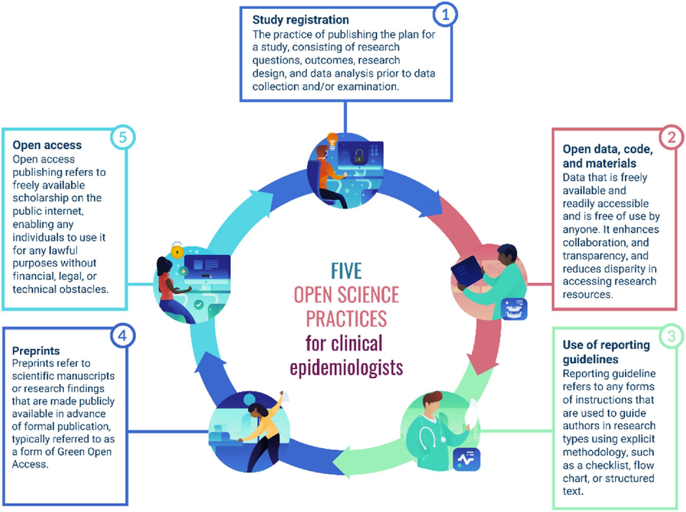

::::::::::::::::::::::::::::::::::::::: objectives

- Understand the importance of reproducible data analysis.
- Identify good practice re: reproducbility.

::::::::::::::::::::::::::::::::::::::::::::::::::

:::::::::::::::::::::::::::::::::::::::: questions

- What is reproducibility and why should I care?

::::::::::::::::::::::::::::::::::::::::::::::::::

## Why reproducibility?

For a number of years there have been concerns about the difficult and sometimes inability to replicate or reproduce analyses or methodologies for a wide range of research studies. For example, in a 2022 paper from [Wang, S. V., et al.][citation_1] an attempt to analytically reproduce comparative-effectiveness estimates from cohort studies using data from health-care databases, 25% of comparative-effectiveness estimates could not be reproduced to within 10% of the original estimate.

In fields like epidemiology which inform government policy and impact on peoples' lives, the ability to
verify analyses is incredibly important. Epidemiological studies are often large, complex, conceived after data have already been collected, and difficult to replicate directly by collecting new data. However, it is possible to ensure their integrity and analytical reproducibility.

Open science practices can help support both reproducible practices but also aid the interpretation of analyses outcomes. The [UNESCO Open Science recommendations](https://unesdoc.unesco.org/ark:/48223/pf0000379949) defines open science as:

>"an  inclusive construct that combines various movements and practices aiming to  make  multilingual  >scientific  knowledge  openly  available,  accessible  and  reusable  for  everyone,  to  increase  >scientific  collaborations  and  sharing  of  information for the benefits of science and society, and to >open the processes of scientific knowledge creation, evaluation and communication to societal actors >beyond the traditional scientific community.".

### What is reproducibility?
[The Turing Way](https://book.the-turing-way.org/reproducible-research/reproducible-research) defines reproducibile research as "work that can be independently recreated from the same data and the same code that the original team used", making it distinct from research that is replicable, robust and generalisable.

They illustrated the differences between the terms with the following diagram:
{alt="Reproducible produces the same answer: when the same data and same analysis are used. Replicable produces qualitatively similar answers: when different data, the same analysis is used. Robust results show that the work is not dependent on the specificities of the programming language chosen to perform the analysis: when the same data, but a different analysis is used. Generalisable: combining replicable and robust findings allow us to form generalisable results."}

Image source:[How the Turing Way defines reproducible research](https://book.the-turing-way.org/reproducible-research/overview/overview-definitions)

### What does this mean practically?

Some specific practices for epidemiology have been identified:

{alt="Five practices for clincal epidemiology. 1 Study registration, 2 open data, code and materials, 3 Use of reporting guidelines, 4 pre prints 5 Open access"}
Image source:[Key challenges in epidemiology: embracing open science](https://www.jclinepi.com/article/S0895-4356(24)00374-3/fulltext#fig1)

Those that relate directly to the skills introduced in this training are:
- Open data, code and materials
- Use of reporting guidelines

#### Open data, code and materials

Open data, code, and material enhance collaboration between researchers, enhance transparency, and reduce research waste and disparity in accessing research resources, in turn accelerating discovery and fostering innovation by following FAIR (Findable, Accessible, Interoperable, Reusable) principles while protecting the sovereignty of indigenous data following CARE (Collective Benefit, Authority to Control, Responsibility, Ethics) principles.

{alt="There are a number of components that need to be shared for work to be reproducible, these include: data, code, tools and results"}

Image source:The Turing Way project illustration by Scriberia. Used under a CC-BY 4.0 licence. DOI: [The Turing Way Community & Scriberia (2024)](https://doi.org/10.5281/ZENODO.3332807).

#### Use of reporting guidelines

Reporting guideline refers to any form of instructions that are used to guide authors in transparently reporting research types using explicit methodology, such as a checklist, flow chart, or structured text.

They provide the minimum guidance required to ensure that research findings can be appropriately interpreted, appraised, synthesized, and replicated. [Network, E. Q. U. A. T. O. R.][citation_2]

[citation_1]: Wang, S. V., et al. "Reproducibility of real-world evidence studies using clinical practice data to inform regulatory and coverage decisions. Nat Commun. 2022 Aug 31; 13 (1): 5126." 2022,

[citation_2]: Network, E. Q. U. A. T. O. R. "EQUATOR Network, Enhancing the quality and transparency of health research." 2016,

:::::::::::::::::::::::::::::::::::::::  challenge

## Practical Experience in Reproducibility

In teams you will:

1. Select a paper: [No Effect of Nature Representations on State Anxiety, Actual and Perceived Noise](https://www.reprohack.org/paper/49/), [Mental Health and Social Contact During the COVID-19 Pandemic: An Ecological Momentary Assessment Study](https://www.reprohack.org/paper/32/) or [Evaluation of the ‘Irish Rules’: The Potato Late Blight Forecasting Model and Its Operational Use in the Republic of Ireland](https://www.reprohack.org/paper/26/)

2. Create a new R markdown document and record: the paper, team members, 
comments on the paper - what helped or hindered reproducibility.

3. Download paper, code and data

4. Work on your selected paper. If you wish to create an account on [Reprohack.org](https://www.reprohack.org/accounts/signup/) and provide feedback.

5. Feedback at the end 

::::::::::::::::::::::::::::::::::::::::::::::::::

